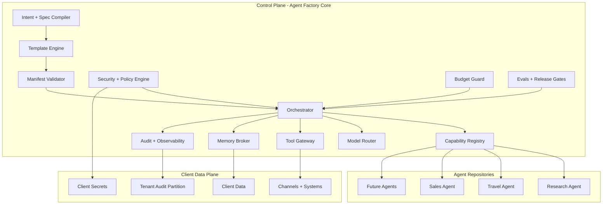

# ארכיטקטורת Agent Factory Core

**Status:** Proposed update for Owner Review  
**Date:** 2026-09-06

## 1. מטרת המערכת

`Agent Factory Core` הוא ה-Control Plane והחוזה המשותף לכל Agent שנבנה על הפלטפורמה. הוא אינו Agent עסקי בפני עצמו ואינו מכיל לוגיקה ספציפית של Travel, Sales, CRM, Research או לקוח מסוים.

המטרה היא לאפשר לבנות, להחליף, לתקן ולתחזק Agents במהירות, בלי לשנות את כל המערכת כאשר Provider, Model, Tool, Runtime או דרישת לקוח משתנים.

העיקרון המנחה הוא:

> שינוי באחריות אחת צריך להיות מקומי ככל האפשר. לשאלה "איפה משנים את זה?" צריכה להיות בדרך כלל תשובה אחת ברורה.

## 2. חלוקת אחריות

### Core אחראי על

- Spec compilation ו-Agent Manifest validation.
- Template selection והרכבת Agent.
- Orchestration ו-Execution Context.
- Capability Registry וניתוב בין Agents.
- Model/Provider routing.
- Tool Gateway והרשאות לכלי.
- Memory contracts ו-Memory access policy.
- Security policy, tenant isolation ו-data controls.
- Budget, quota ו-cost guardrails.
- Audit, observability, traces ו-release evidence.
- Evaluations, release gates, rollback ו-drift detection.
- Runtime adapters וחוזים משותפים.

### Core אינו אחראי על

- Prompts עסקיים של Agent ספציפי.
- Workflow עסקי ייחודי ללקוח.
- Knowledge base של לקוח.
- Credentials של לקוח.
- Business rules שאינם כלל פלטפורמה.
- UI עסקי ייחודי ל-Agent מסוים.

### כל Agent repo אחראי על

- Business intent ו-Scope.
- Agent-specific behavior.
- Capabilities שהוא מספק ודורש.
- Agent-specific tools או adapters שאינם כלליים.
- Acceptance tests ו-evaluation set שלו.
- Client-specific configuration דרך Manifest ו-Spec, ללא שכפול מנגנוני Core.

## 3. שתי שכבות מערכת



## 4. Execution Context חובה

כל Agent invocation מקבל Context אחיד מה-Core. Agent אינו רשאי להמציא, להרחיב או לעקוף אותו.

```text
ExecutionContext
- request_id
- tenant_id
- actor_id
- actor_type
- environment
- agent_id
- agent_release_id
- permissions
- data_classification
- budget_context
- model_policy
- tool_policy
- memory_policy
- trace_id
- deadline
```

ה-Context הוא המקור להרשאה, תקציב, Traceability ו-Isolation. Prompt אינו מקור סמכות.

## 5. Agent Manifest

כל Agent חייב לספק Manifest תקין לפני Build או Runtime. ה-Manifest מתאר מה ה-Agent הוא, מה הוא יודע לעשות, מה הוא דורש ומה אסור לו לעשות.

ה-Core משתמש בו כדי:

- לבחור Template.
- לבדוק Capabilities.
- להחיל Security profile.
- לבחור Model/Provider policy.
- לחבר Tools ו-Memory.
- להגדיר Budget ו-approval routes.
- להריץ Evals ו-Release gates.

הסכמה המלאה מוגדרת ב-`docs/agent-manifest.md` וב-`templates/agent-manifest.yaml`.

## 6. Template-first

Agent חדש אינו נבנה מאפס.

תהליך ברירת המחדל:

`Client Intent -> Spec -> Template -> Manifest -> Adapters/Tools -> Evals -> Release`

ה-Core מחזיק את Template Engine ואת חוזי התבניות. תבניות מערכת בסיסיות יכולות להישמר ב-Core. תבניות Agent עסקיות גדולות יכולות להישמר כריפו או Package נפרד ולהירשם ב-Template Registry.

המטרה היא להימנע מ-Monorepo שבו כל Agent וכל Business Logic מתערבבים.

## 7. תקשורת בין Agents

Agents אינם קוראים זה לזה לפי URL, repo name או implementation detail. Agent מבקש Capability.

דוגמה:

```text
Travel Agent requires: research.lookup
Core resolves: Research Agent v1.3
```

ה-Core בודק לפני הניתוב:

- Tenant.
- Permissions.
- Data classification.
- Cost policy.
- Capability contract version.
- Availability ו-health.

כך ניתן להחליף Research Agent, להפעיל כמה implementations או לבצע fallback בלי לשנות את Travel Agent.

## 8. Provider ו-Model independence

Business logic אינו תלוי ישירות ב-OpenAI, Anthropic, Google, DeepSeek או Provider אחר.

Agent מבקש `Model Profile`, לדוגמה:

- `fast-cheap`
- `balanced`
- `high-reasoning`
- `private-data-compatible`
- `long-context`

ה-Model Router ממפה Profile ל-Provider ול-Model בפועל לפי Policy, תקציב, זמינות, latency, data requirements ו-quality target.

החלפת Provider אמורה להיות שינוי Policy/Configuration עם Regression Eval, לא Rewrite של Agent.

## 9. Tool Gateway

Agent אינו מקבל גישה חופשית ל-Network, Files, Database או SaaS.

כל Tool invocation עובר דרך Tool Gateway שמבצע:

1. Schema validation.
2. Permission check.
3. Tenant check.
4. Side-effect classification.
5. Budget/preflight check כאשר רלוונטי.
6. Human approval כאשר נדרש.
7. Timeout ו-retry policy.
8. Audit event.

Web, MCP, API ו-Agent-to-Agent הם כולם מקורות חיצוניים מבחינת Trust Model. תוכן שמוחזר מהם נחשב Untrusted Data עד Policy evaluation.

## 10. Memory Broker

Memory אינה API ישיר של Agent ל-Storage. ה-Core מספק חוזה Memory אחיד:

- Session memory.
- User-approved persistent memory.
- Client knowledge retrieval.
- Operational state.

כל read/write נבדק לפי Tenant, Classification, Purpose, Retention ו-Permissions.

Agent-specific memory strategy יכולה להשתנות, אבל אינה יכולה לעקוף Isolation או Retention.

## 11. Security as a platform invariant

Security אינו Feature אופציונלי של Agent.

ה-Core אוכף לפחות:

- Least privilege.
- Default deny.
- Tenant isolation.
- Secrets boundary.
- Prompt injection containment.
- Tool allowlists.
- Egress controls לפי סיכון.
- Human approval לפעולות מוגנות.
- Audit trail.
- Budget guardrails.
- Runtime limits.

Agent repo רשאי להחמיר Policy. הוא אינו רשאי להחליש Minimum Baseline.

## 12. Budget as a first-class control

יש להפריד בין שני סוגי גבול:

1. **Business budget** - גבול שנקבע עם הלקוח. המערכת מתריעה ומתבקשת הרשאה מפורשת לפני חריגה.
2. **Emergency safety cap** - תקרת בטיחות תפעולית שמונעת runaway spend או loop חריג. היא מוגדרת על ידי הפלטפורמה ואינה תחליף לתקציב העסקי.

ב-Build time ה-Owner מאשר את פרופיל העלות והחלופות. ב-Runtime הלקוח או גורם מאושר אצלו מאשר חריגה מתקציב שהוגדר לו.

## 13. Client-facing Black Box

הלקוח אינו אמור לבחור MCP, API, Model, Vector DB או Runtime.

הוא מתאר מטרה עסקית בשפה רגילה. הפלטפורמה:

1. מזהה Intent.
2. שואלת רק שאלות קריטיות.
3. משלימה הנחות לא קריטיות ומציגה אותן לאישור.
4. מציעה חלופות לפי תקציב.
5. יוצרת Spec ו-Manifest.
6. בונה ומעריכה Agent.
7. מציגה ללקוח את התוצאה, מגבלות, מחיר משוער ואישורים נדרשים.

יעד UX ראשוני: רוב ה-Intake הראשוני מסתיים בפחות מ-10 דקות.

## 14. Client Data Plane

לכל לקוח נשמרים גבולות נפרדים עבור:

- Identity ו-Roles.
- Runtime context.
- Knowledge ו-State.
- Credentials.
- Audit.
- Evaluation data.
- Retention ו-deletion.

מידע לקוח ו-Secrets אינם חוזרים ל-Control Plane כ-raw data. ה-Core מחזיק Metadata ו-Evidence נדרשים בלבד.

## 15. Release contract

כל Release מזוהה באמצעות `agent_release_id` ומקושר ל:

- Agent Manifest version.
- OpenSpec change.
- Commit SHA.
- Template version.
- Policy versions.
- Model routing profile.
- Tool contract versions.
- Eval results.
- Security evidence.
- Human approvals.
- Rollback target.

Runtime drift שאינו מיוצג ב-Release contract חוסם Promotion.

## 16. גבולות MVP של ה-Core

בשלב הראשון ה-Core צריך להוכיח רק את החוזים הקריטיים:

- Manifest validation.
- Execution Context.
- Security/permission gate.
- Budget precheck.
- Provider-neutral model call.
- Capability registration/resolution.
- Audit event.
- Eval gate בסיסי.

אין צורך ב-MVP ב-Kubernetes, Service Mesh, multi-region או distributed agent bus מורכב.

## 17. Agent הבא לאחר ייצוב ה-Core

ה-Agent הראשון שנבנה לפי החוזים החדשים יהיה Research/Brain Agent בריפו נפרד.

הוא יספק Capability כללית כגון `research.lookup` ויחליט, תחת Policy, האם להשתמש ב:

- Knowledge פנימי.
- Web search.
- API.
- MCP.
- Agent אחר.
- Model knowledge כאשר מותר ומתאים.

Travel Agent ישמש בהמשך Consumer ראשון של Capability זו כדי לבדוק שה-Core אכן מאפשר שימוש חוזר ולא תלות ב-Provider יחיד.
