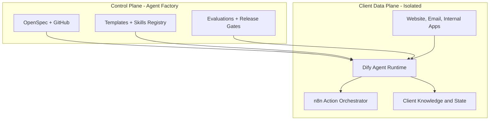
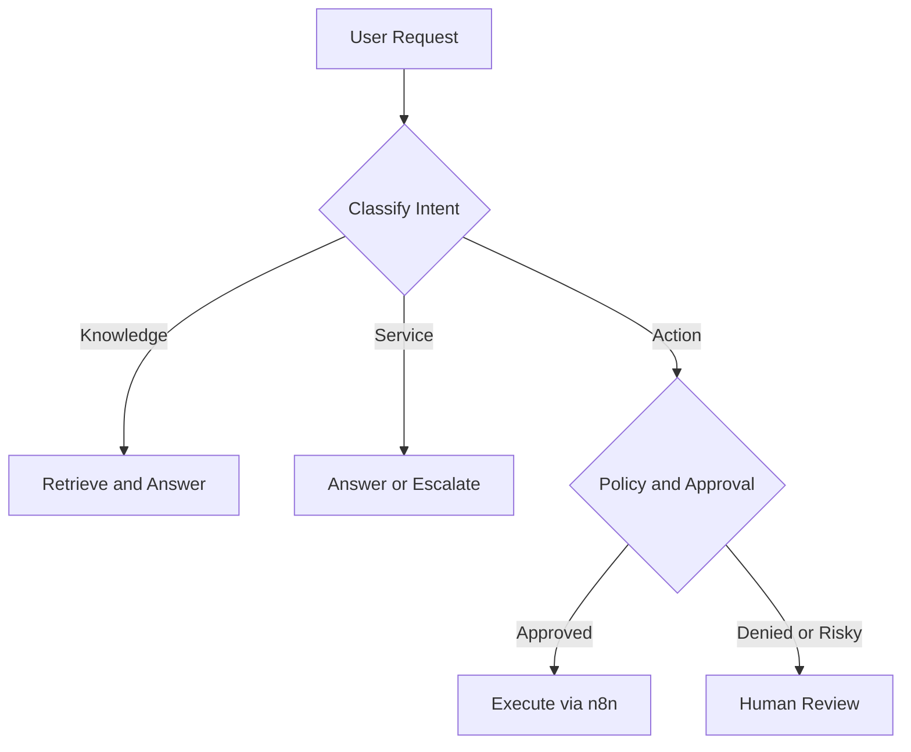

# ארכיטקטורת Agent Factory

## 1. עיקרון מרכזי

המערכת מחולקת לשתי שכבות:

- Control Plane: המתודולוגיה, המפרטים, התבניות, בדיקות הקבלה, רישום ה-Skills והחלטות הארכיטקטורה.
- Client Data Plane: מופע נפרד של סוכן עבור כל לקוח, כולל מקורות מידע, Credentials, Channels, Logs והרשאות.

ה-Factory אינו מאגר משותף של מידע לקוחות. הוא מייצר תצורה ומפרט שנפרסים למופע מבודד.

## 2. רכיבי הליבה

| רכיב | תפקיד | שלב |
|---|---|---|
| GitHub + OpenSpec | מקור אמת למפרטים, שינויים ואישור | Phase 0 |
| Codex | תכנון, יצירת מפרטים ומימוש משימות מאושרות | Phase 0 |
| Dify | צ'אט, RAG, Workflows וניהול Agent ללא קוד רב | Phase 1 |
| n8n | אוטומציות, Webhooks וחיבורים למערכות | Phase 1 |
| OpenAI API | מודל שפה, Embeddings וסיווג לפי צורך | Phase 1 |
| Managed storage | מסמכים, Metadata ו-State לפי לקוח | Phase 1-2 |
| Observability | Logs, Traces, Cost ו-Quality Metrics | Phase 2 |
| WhatsApp provider | ערוץ WhatsApp מאושר ומבוקר | Phase 3 |

## 3. תבנית מופע לקוח

לכל לקוח נוצרים לפחות:

- OpenSpec Change נפרד.
- Namespace או Project נפרד ב-Dify.
- Workflows ו-Credentials נפרדים ב-n8n.
- Knowledge Base נפרד.
- מפת הרשאות ואישור פעולות.
- מדיניות שמירה ומחיקה.
- Evaluation Set ו-Acceptance Tests.
- מסמך מסירה ו-Runbook.

## 4. סוגי סוכנים

### Knowledge Agent

מקבל מסמכים מאושרים, מאנדקס אותם ומחזיר תשובות עם מקור. כאשר אין מקור מספיק, הוא מצהיר שאין תשובה ולא ממציא.

### Customer Service Agent

משלב Knowledge Agent עם ניהול שיחה, זיהוי כוונה, איסוף פרטים מינימלי, Escalation לאדם והעברת Context מבוקרת.

### Action Agent

מפיק הצעת פעולה מובנית, בודק הרשאות, מבקש אישור כאשר נדרש, מפעיל Workflow ב-n8n ושומר Audit Event.

## 5. זרימת בקשה

## 6. גבולות MVP

ה-MVP הראשון יכלול:

- צ'אט באתר בסביבת בדיקה.
- סוכן ידע ממסמכים סינתטיים או לא רגישים.
- פעולה פנימית אחת הפיכה, לדוגמה יצירת Draft או פתיחת משימה.
- Escalation לאדם.
- Audit בסיסי ובדיקות קבלה.

ה-MVP לא יכלול:

- מידע רפואי או פיננסי אמיתי.
- פעולות כספיות או שינויי חשבון ללא אדם.
- Multi-tenant database משותף ללא Row-Level Security מוכח.
- WhatsApp Production לפני השלמת אבטחה, Consent ו-Retention.

## 7. החלטות פתוחות לפני מימוש

1. Cloud-hosted מול Self-hosted עבור Dify ו-n8n.
2. ספק Storage ו-Vector Store לכל מופע לקוח.
3. ספק WhatsApp ודרישות Template Messages.
4. יעד Logs ומשך שמירה.
5. מודל תמיכה, SLA ותחומי אחריות מול לקוח.

