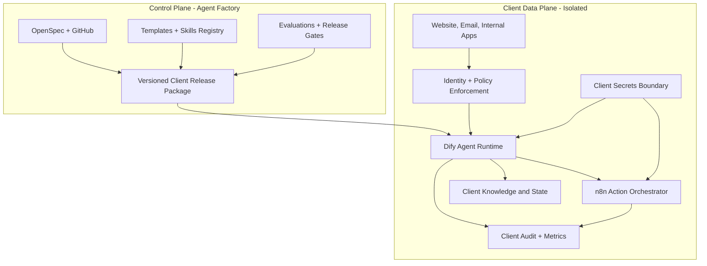
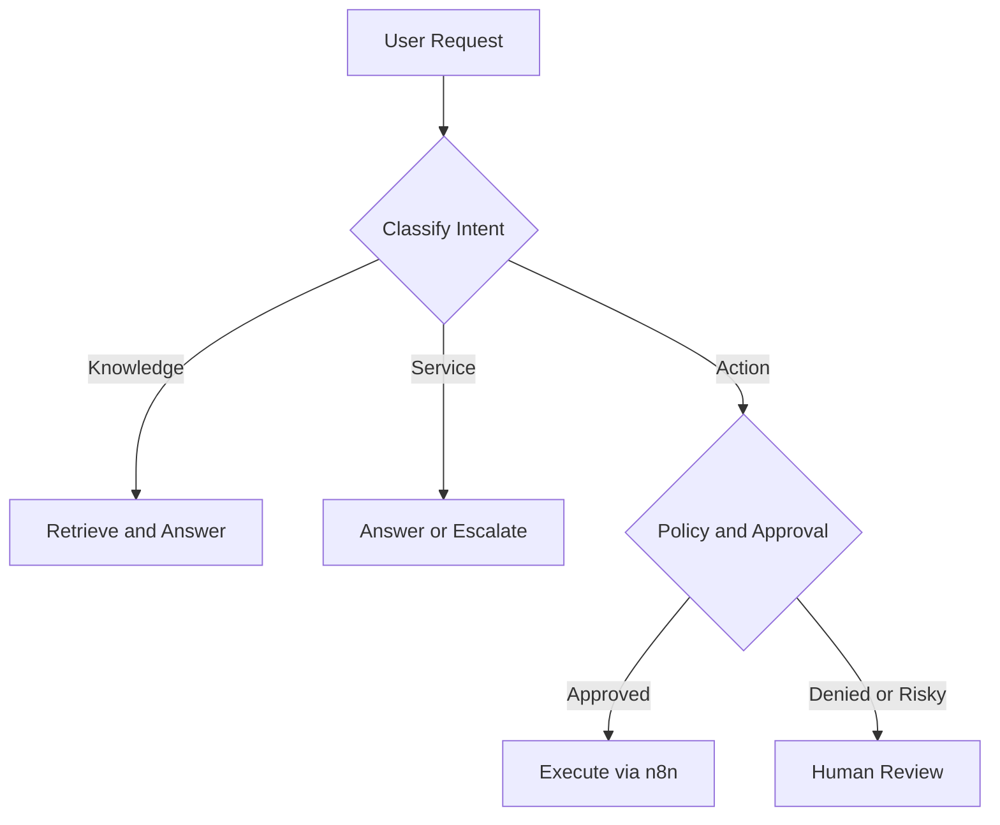

# ארכיטקטורת Agent Factory

## 1. עיקרון מרכזי

המערכת מחולקת לשתי שכבות:

- Control Plane: המתודולוגיה, המפרטים, התבניות, בדיקות הקבלה, רישום ה-Skills והחלטות הארכיטקטורה.
- Client Data Plane: מופע נפרד של סוכן עבור כל לקוח, כולל מקורות מידע, Credentials, Channels, Logs והרשאות.

ה-Factory אינו מאגר משותף של מידע לקוחות. הוא מייצר תצורה ומפרט שנפרסים למופע מבודד.

החץ מ-Control Plane ל-Client Data Plane מייצג חבילת תצורה מאושרת וממוספרת, ולא גישה ישירה של ה-Factory לנתוני הלקוח. מידע לקוח, Credentials ו-Logs לעולם אינם חוזרים ל-Control Plane.

## 2. רכיבי הליבה

| רכיב | תפקיד | שלב |
|---|---|---|
| GitHub + OpenSpec | מקור אמת למפרטים, שינויים ואישור | Phase 0 |
| Codex | תכנון, יצירת מפרטים ומימוש משימות מאושרות | Phase 0 |
| Dify | צ'אט, RAG, Workflows וניהול Agent ללא קוד רב | Phase 1 |
| n8n | אוטומציות, Webhooks וחיבורים למערכות | Phase 1 |
| OpenAI API | מודל שפה, Embeddings וסיווג לפי צורך | Phase 1 |
| Managed storage | מסמכים, Metadata ו-State לפי לקוח | Phase 1-2 |
| Observability | Logs, Traces, Cost ו-Quality Metrics | Phase 2 |
| WhatsApp provider | ערוץ WhatsApp מאושר ומבוקר | Phase 3 |

## 3. תבנית מופע לקוח

לכל לקוח נוצרים לפחות:

- OpenSpec Change נפרד.
- Namespace או Project נפרד ב-Dify.
- Workflows ו-Credentials נפרדים ב-n8n.
- Knowledge Base נפרד.
- מפת הרשאות ואישור פעולות.
- מדיניות שמירה ומחיקה.
- Evaluation Set ו-Acceptance Tests.
- מסמך מסירה ו-Runbook.

### רמות בידוד

| גבול | דרישת מינימום | אסור לשתף |
|---|---|---|
| Identity | משתמשים, Roles ו-Service Accounts מזוהים ללקוח | חשבון שירות משותף בין לקוחות |
| Runtime | Project או Environment ייעודי עם מזהי לקוח מפורשים | Context או Session בין לקוחות |
| Knowledge | Knowledge Base, Index ו-Storage namespace ייעודיים | אינדקס Retrieval משותף |
| Secrets | Credential set נפרד והרשאות Least Privilege | API key או OAuth grant משותף |
| Audit | יעד או partition הניתן לבידוד ולמחיקה לפי לקוח | Log ללא tenant identifier |
| Evaluation | Dataset ותוצאות נפרדים לגרסת הסוכן | נתוני בדיקה אמיתיים של לקוח אחר |

Project לוגי נחשב גבול בידוד רק לאחר בדיקה שמוכיחה כי משתמש או Workflow של Client A אינם יכולים לקרוא, לחפש, להפעיל או לייצא משאבים של Client B. מידע `Confidential`, `Personal` או `Sensitive` עשוי לחייב Account, Workspace או Deployment נפרד לפי יכולות הספק והערכת הסיכון.

## 4. זהות, הרשאות ומדיניות

- כל בקשה מזוהה באמצעות `tenant_id`, `actor_id`, `actor_type`, `channel`, `environment` ו-`request_id`.
- Roles מינימליים: `Owner`, `Client Process Owner`, `Operator`, `Reviewer`, `End User` ו-`Service Account`.
- הרשאה נבדקת לפני Retrieval ולפני Tool execution; הסוכן אינו מקור סמכות להרשאות.
- Service Accounts מקבלים Scope מצומצם לפעולה אחת או לקבוצת פעולות מאושרת.
- Approval חייב להיות קשור ל-`request_id`, לפעולה המדויקת, למאשר ולזמן תפוגה. אישור כללי בשיחה אינו מספיק.

## 5. סוגי סוכנים

### Knowledge Agent

מקבל מסמכים מאושרים, מאנדקס אותם ומחזיר תשובות עם מקור. כאשר אין מקור מספיק, הוא מצהיר שאין תשובה ולא ממציא.

### Customer Service Agent

משלב Knowledge Agent עם ניהול שיחה, זיהוי כוונה, איסוף פרטים מינימלי, Escalation לאדם והעברת Context מבוקרת.

### Action Agent

מפיק הצעת פעולה מובנית, בודק הרשאות, מבקש אישור כאשר נדרש, מפעיל Workflow ב-n8n ושומר Audit Event.

## 6. זרימת בקשה

חוזה הבקשה המשותף לכל הערוצים כולל לפחות:

| Field | Purpose |
|---|---|
| `request_id` | Correlation ו-Idempotency |
| `tenant_id` | בידוד וניתוב |
| `actor_id` / `actor_type` | הרשאה ו-Audit |
| `channel` | מדיניות ערוץ |
| `agent_release_id` | שיוך לגרסת מפרט ותצורה |
| `data_classification` | אכיפת מדיניות מידע |
| `intent` | Knowledge, Service או Action |
| `payload` | קלט ממוזער ומאומת לפי Schema |

## 7. חבילת גרסה ותהליך Release

כל גרסת לקוח ניתנת לשחזור באמצעות `agent_release_id` ומכילה הפניות ל:

- Commit SHA ו-OpenSpec change מאושר.
- גרסאות Prompt, Workflow, Knowledge manifest ו-Policy.
- Schemas של קלט ופלט וגרסאות Tool contracts.
- Evaluation set, תוצאות, מאשרים וזמן אישור.
- Environment, Provider configuration ו-Rollback target ללא Secrets.

תהליך השחרור הוא: `Draft Spec → Owner Approval → Synthetic Evaluation → Security Checks → Client Acceptance → Release Manifest → Controlled Deployment`. אין לפרוס ישירות מ-branch לא מאושר ואין להכניס Secrets לחבילת הגרסה.

## 8. מחזור חיי מופע לקוח

1. `Intake`: סיווג צורך, מידע, סיכון ותקציב.
2. `Specified`: OpenSpec ו-Acceptance Tests מאושרים.
3. `Provisioned`: גבולות Runtime, Storage, Secrets ו-Audit נוצרו.
4. `Pilot`: נתונים מאושרים בלבד, Limits ו-Human Review פעילים.
5. `Production`: רק לאחר Gate G4 ותיעוד אחריות.
6. `Suspended`: פעולות חיצוניות חסומות, Retrieval לפי מדיניות.
7. `Decommissioned`: גישה בוטלה, נתונים נמחקו או הוחזרו, והמחיקה תועדה.

שינוי Classification, Provider, Channel, Tool בעל Side Effect או גבול בידוד מחייב OpenSpec change חדש ובדיקת Regression.

## 9. עמידות ותפעול

- פעולות חיצוניות נכשלות במצב סגור (`fail closed`).
- Retry מוגבל לפעולות בטוחות ואידמפוטנטיות בלבד.
- לכל מופע מוגדרים Owner לתקלה, Runbook, Rollback target ו-Budget cap.
- גיבוי ושחזור נבדקים לפני Production; יעדי RPO/RTO נקבעים לפי לקוח וסיווג מידע.
- Degraded mode מאפשר תשובת מידע או Escalation כאשר ספק פעולה אינו זמין, בלי לעקוף Policy.

## 10. גבולות MVP

ה-MVP הראשון יכלול:

- צ'אט באתר בסביבת בדיקה.
- סוכן ידע ממסמכים סינתטיים או לא רגישים.
- פעולה פנימית אחת הפיכה, לדוגמה יצירת Draft או פתיחת משימה.
- Escalation לאדם.
- Audit בסיסי ובדיקות קבלה.

ה-MVP לא יכלול:

- מידע רפואי או פיננסי אמיתי.
- פעולות כספיות או שינויי חשבון ללא אדם.
- Multi-tenant database משותף ללא Row-Level Security מוכח.
- WhatsApp Production לפני השלמת אבטחה, Consent ו-Retention.

## 11. החלטות שהתקבלו ופתוחות לפני מימוש

1. התקבלה החלטה להתחיל במסלול Managed Cloud ל-Prototype עם מידע סינתטי בלבד, כמפורט ב-ADR-001.
2. התקבלה החלטה להשתמש בבידוד לקוחות מבוסס סיכון, כמפורט ב-ADR-002. מיפוי Isolation tier מדויק לכל Classification נשאר משימת תכנון לפני Production.
3. התקבלה החלטה לנהל Release manifest ממוספר וראיות Gate, כמפורט ב-ADR-003.
4. התקבלה החלטה לבחור ב-Dify Cloud Sandbox כ-Runtime המיועד ל-Prototype הסינתטי בלבד, עם Dify Knowledge Base ו-`R-A` כמועמד המיפוי הראשון, כמפורט ב-ADR-004. Provisioning ו-Runtime עדיין אינם מאושרים.
5. ספק Storage ו-Vector Store לכל מופע לקוח.
6. יעד Logs, משך שמירה ויעדי RPO/RTO.
7. מודל תמיכה, SLA ותחומי אחריות מול לקוח.
8. ספק WhatsApp ודרישות Consent ו-Template Messages במסגרת Change עתידי נפרד.

