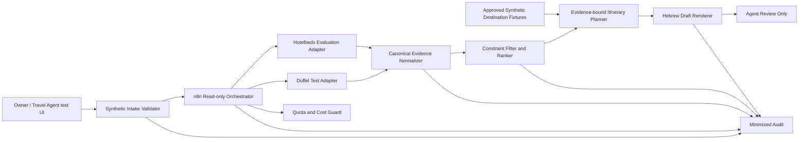

# תכנון: Automated Travel Proposal PoC v1

## הקשר

מטרת ה-PoC היא להוכיח זרימת עבודה אוטומטית להכנת הצעת נסיעה בלי להסתמך על API שאינו זמין ל-Owner ובלי לבצע פעולה מסחרית. Travel Booster ו-Amadeus אינם זמינים כרגע דרך API מאושר. Botpress אינו כשיר לשימוש בגלל `INCIDENT-HOLD`. לכן התכנון מפריד בין ממשק הסוכן, תזמור החיפוש, מתאמי הספקים, מנוע התכנון וחוזה הפלט.

היכולת היא שילוב של Service לקריאה בלבד ו-Knowledge ליצירת מסלול מבוסס ראיות. היא אינה Action Agent ואינה מוסמכת לבצע הזמנה או לשלוח הודעה.

## מטרות תכנון

1. להוכיח תהליך אוטומטי מקלט ועד טיוטה, ללא שלבים ידניים של איסוף הצעות.
2. לשמור על חוזה קנוני שאינו תלוי ב-Duffel או Hotelbeds.
3. למנוע מעבר מקריאה לפעולה גם אם ספק מציע Booking API באותו Credential.
4. להציג בבירור מהו נתון ספק, חישוב, הנחה או מידע חסר.
5. להיכשל סגור בכשל ספק, חריגת מכסה, Schema drift, מידע רגיש או חוסר ראיות.
6. לשמור את ה-PoC קטן, ניתן לשחזור ותואם לתקציב ולזמן Owner יחיד.

## ארכיטקטורה מוצעת

### שכבת ממשק

ממשק הבדיקה העתידי יקבל נתונים סינתטיים בלבד ויציג טיוטה. הוא לא יהיה מקור הרשאה. Dify הוא Runtime ה-Low-Code המוצע בהתאם לארכיטקטורת המאגר, אך בחירת App, Model או Provider נשארת Gate נפרד. Botpress אינו מועמד בשינוי הזה.

### שכבת תזמור

`n8n` הוא הכיוון המוצע למימוש עתידי של orchestration ו-policy enforcement. לכל ספק יהיה Workflow או Sub-workflow נפרד עם פעולות allow-listed בלבד, Timeout, Retry מוגבל, Idempotency key ברמת `request_id + adapter + search_hash`, ומדידת מכסה לפני כל קריאה.

### שכבת מתאמים

כל Adapter יקבל בקשה קנונית ויחזיר רשומות Evidence קנוניות. ה-Adapter לא יעביר Payload גולמי ישירות למודל ולא יחשוף פעולה שאינה קריאה.

פעולות עתידיות מותרות עקרונית רק לאחר Gate יישום מדויק:

- Duffel Test: `POST /air/offer_requests`, `GET /air/offer_requests/{id}`, `GET /air/offers` ו-`GET /air/offers/{id}` בלבד, ורק לאחר Gate Network נפרד. `return_offers=false` עדיף כאשר נדרשים Pagination וסינון מפוקחים.
- Hotelbeds Evaluation: `POST /hotel-api/1.0/hotels` ל-Availability; `POST /hotel-api/1.0/checkrates` רק עבור Rate מסוג `RECHECK`; ו-`GET /hotel-content-api/1.0/hotels` בתהליך Cache/Batch ייעודי בלבד. `Bookings` חסום.

הנתיבים הם allow-list מועמד בלבד ואינם מאשרים Network. לפני G5 יינעלו Hostname, גרסת API, פרמטרים, Schema, תקרת תוצאות ו-Request count ב-Configuration מאושר. כל נתיב אחר נכשל סגור.

### שכבת נרמול

ה-Normalizer ישמור שני סוגי ראיות:

- `FlightOfferEvidence`
- `HotelOfferEvidence`

שדות משותפים:

- `schema_version`
- `tenant_id`
- `request_id`
- `provider`
- `provider_reference`
- `environment`
- `searched_at`
- `expires_at` כאשר סופק
- `currency`
- `total_amount`
- `restrictions`
- `completeness`
- `raw_evidence_reference`

ה-PoC לא ישמור Payload מלא כברירת מחדל. אם ראיה גולמית נחוצה ל-Debug, היא תישמר רק בסביבה מקומית מאושרת, עם Retention קצר, Redaction ומזהה בלתי הפיך; המדיניות המדויקת דורשת Gate יישום.

### שכבת סינון ודירוג

הדירוג יתחיל בסינון אילוצים קשיחים ולאחר מכן בציון משוקלל. משקלים מוצעים לדיון ב-Gate היישום:

- התאמה לתאריכים ולמספר נוסעים: תנאי סף.
- תקציב: תנאי סף או משקל לפי בקשת המשתמש.
- טיסה ישירה ומספר עצירות.
- משך כולל ושעות יציאה/הגעה.
- מחיר ניסוי מנורמל באותו מטבע בלבד.
- דירוג מלון, מיקום ושירותים רק כאשר הספק סיפק אותם.
- התאמה להעדפות מפורשות.

כל ציון יכלול breakdown שניתן להסבר. המודל לא יבחר אופציה שסוננה על ידי אילוץ קשיח.

### שכבת תכנון מסלול

ב-PoC הראשוני, תוכן יעד יגיע מ-fixtures סינתטיים ומאושרים. אין Web search ואין Google Places/Routes. המתכנן יקבל רק Evidence מנורמל ו-fixtures ויפיק:

- סיכום דרישות;
- טיסות ומלונות נבחרים;
- חלופות;
- מסלול יומי;
- הנחות ומידע חסר;
- אומדן עלות נפרד לפי מטבע;
- אזהרת Sandbox/Evaluation;
- שאלות לסוכן.

אם Evidence אינו מספיק, המתכנן יחזיר `INSUFFICIENT_EVIDENCE` או טיוטה חלקית מסומנת.

## זרימת נתונים

1. הסוכן מזין בקשה סינתטית.
2. Intake Validator מאמת Schema ומסיר או חוסם שדות אסורים.
3. Cost Guard בודק Gate, מכסה ותקציב לפני כל Provider או Model call.
4. Orchestrator מפעיל חיפושי טיסה ומלון לקריאה בלבד.
5. Adapters מאמתים Schema ומנרמלים ראיות.
6. Constraint Filter מסיר תוצאות שאינן עומדות בדרישות קשיחות.
7. Ranker מדרג ומפיק הסבר דטרמיניסטי.
8. Planner משלב ראיות עם fixtures סינתטיים בלבד.
9. Renderer מפיק טיוטה בעברית המסומנת לבדיקה אנושית.
10. Audit רושם אירועים ממוזערים; אין שליחה או פעולה חיצונית.

## הרשאות וגבולות כלים

- Runtime identity, Service Accounts ו-Credentials יהיו נפרדים לכל Tenant ו-Environment.
- Credentials יקבלו Least Privilege ויישמרו רק ב-Credential Store.
- Adapter allow-list יהיה מפורש; Endpoint שאינו ברשימה ייחסם.
- HTTP כללי חופשי אינו חלק מה-PoC; רק Hostnames ופעולות מאושרים.
- Booking, Payment, Order, Hold, Cancel, Refund, Ticketing, PNR mutation ו-Messaging יהיו deny-listed בנוסף ל-allow-list.
- Prompt או תשובת מודל אינם יכולים לשנות הרשאה, מכסה או Provider.

## אבטחה ופרטיות

- Tenant ראשון: `travel-poc-synthetic` בלבד.
- מידע: Synthetic/Public fixture בלבד.
- נתוני ספק נחשבים untrusted input ועוברים Validation ו-escaping.
- אין Prompt מלא, Payload מלא, Secret או PII ב-Audit.
- לכל Provider יוגדרו Owner, Purpose, Classification, Retention, Access ו-Deletion לפני הפעלה.
- Cross-tenant tests, secret-leak tests ו-prompt-injection tests הם Acceptance חובה.
- ספקים חיצוניים אינם Skills; אין Import או execution של Script ספק ללא סקירה ואישור.

## כשל ו-Fallback

| מצב | התנהגות |
|---|---|
| Intake חסר | שאלת הבהרה; אין Provider call |
| מידע רגיש | חסימה/Redaction לפי Policy; אין Provider call |
| Timeout זמני | Retry מוגבל ומדוד רק אם אושר |
| 401/403 | עצירת Adapter; אין חשיפת Secret |
| 429 או מכסה | עצירה והצגת Partial/No result |
| Schema drift | Quarantine לתשובה ופתיחת Adapter review |
| אין טיסות | אין המלצת טיסה מומצאת |
| אין מלונות | אין המלצת מלון מומצאת |
| ספק אחד נכשל | טיוטה חלקית מסומנת, אם הקטגוריה השנייה מספיקה |
| כל הספקים נכשלו | `INSUFFICIENT_EVIDENCE`; אין מחיר |
| מטבעות שונים | סכומים נפרדים ללא שער מומצא |
| מודל אינו זמין | Template fallback או כשל מוסבר; אין retry בלתי מוגבל |

## Observability ו-Audit

אירוע ממוזער יכלול:

- `tenant_id`
- `request_id`
- `actor_id` פסאודונימי
- `agent_release_id`
- `adapter_version`
- `action`
- `policy_decision`
- `provider`
- `environment`
- `result_category`
- `latency_ms`
- `provider_calls`
- `model_usage` כאשר אושר
- `cost_indicator`
- `timestamp`

מדדי PoC:

- שיעור בקשות תקינות שמסתיימות בטיוטה או fallback תקין.
- שיעור אפשרויות עם Evidence מלא.
- זמן כולל וזמן לכל ספק.
- Provider error rate ו-Schema drift count.
- מספר קריאות, retries ועלות נמדדת.
- שיעור טענות מתומחרות עם מקור וזמן חיפוש.
- מספר ניסיונות פעולה שנחסמו.

## תכנון עלות ומכסה

- שלב Spec אינו צורך API, Runtime, Model או Billing.
- Duffel Test אינו מיועד להוכחת מחיר אמיתי.
- Hotelbeds Evaluation מוגבל לפי התיעוד הציבורי ל-50 בקשות ביום; Gate עתידי יקבע תקרת Stage נמוכה יותר.
- Google Maps Platform נשאר חסום כי הפעלה דורשת Billing.
- לפני Model call יוגדרו Model, תקרת Tokens, מספר בקשות, Retry ותקציב ILS.
- חסר מחיר עדכני או Currency conversion לא ייחשב אפס.
- כל מעבר ל-Production, תשלום או Overage דורש אישור פיננסי נפרד.

## ממצאי G1 Public Provider Preflight

הבדיקה בוצעה ב-2026-08-22 ממקורות ציבוריים רשמיים בלבד. לא נפתח חשבון, לא התקבלו תנאים בשם ה-Owner, לא נוצר Credential ולא בוצעה קריאת API.

### Duffel

- Test mode מאפשר לבדוק התנהגות אינטגרציה ללא כסף או הזמנות אמיתיים, אך Duffel Airways אינו מספק לוחות זמנים או מחירים מציאותיים. לכן הוא מתאים ל-Contract/Failure PoC בלבד ולא להוכחת איכות הצעה מסחרית.
- Flight search מתחיל ב-`POST https://api.duffel.com/air/offer_requests`; תוצאות ניתנות להחזרה בבקשה או להיקרא ב-`GET /air/offers?offer_request_id=...`. Offer בודד נקרא ב-`GET /air/offers/{id}` ועלול לפוג או להשתנות.
- ההסכם הציבורי אוסר שימוש למטרות Metasearch. בנוסף, תמחור פומבי כולל יחס Search-to-Book; כאשר אין Orders, החישוב החוזי מתייחס לכך כ-Order אחד. מוצר Production של "טיוטה בלבד" דורש אפוא אישור כתוב מ-Duffel לפני תכנון מסחרי.
- מעבר ל-Live דורש פרטי כרטיס ויתרה. פעולות אלה פיננסיות ומחוץ לתחום.
- לא נמצאה ראיה ציבורית מספקת לזכאות העסק הישראלי, לאישור Search-only ב-Production, לעלות Stays מלאה או למחיקה יזומה לפי דרישת ה-PoC.
- החלטה: `CONDITIONAL-GO / ACCOUNT-BLOCKED` ל-Test בלבד; `NO-GO / OUT-OF-SCOPE` ל-Production.

### Hotelbeds / HBX Group

- הרשמה ציבורית מספקת Evaluation credentials, סביבת `https://api.test.hotelbeds.com` ומכסה של 50 בקשות ביום; חריגה מתועדת כ-403. Evaluation booking אינו יוצר הזמנה אמיתית או חיוב, אך Endpoint ההזמנה עדיין מחוץ לתחום.
- Availability מתבצע ב-`POST /hotel-api/1.0/hotels`. `POST /hotel-api/1.0/checkrates` נדרש רק כאשר התוצאה מסומנת `RECHECK`. כל `/bookings` חסום.
- Content API מיועד ל-Batch/cache תקופתי; התיעוד מזהיר שלא להשתמש בו בזמן אמת, אחרת Credentials עלולים להיחסם. לכן ה-PoC לא ישלב Content fetch במסלול בקשה אינטראקטיבי.
- מסלול Certification הציבורי בודק Workflow שממשיך עד Booking, ומעבר ל-Production דורש פנייה ובדיקה. התאמה מסחרית למוצר Search-only לא הוכחה.
- לא נמצאה ראיה ציבורית מספקת לזכאות העסק הישראלי, למחיר Production, ל-Data residency או למדיניות Retention/Deletion מדויקת עבור Evidence ה-PoC.
- החלטה: `CONDITIONAL-GO / ACCOUNT-BLOCKED` ל-Evaluation בלבד; `NO-GO / OUT-OF-SCOPE` ל-Production.

### בחירת ספק חשבון מועמד

`Duffel Test` נבחר תחילה ל-G2, אך טופס ההרשמה הציבורי לא כלל את ישראל ב-`Country of incorporation`. בהתאם לדרישת דיוק ה-KYC, לא נבחרה מדינה חלופית והספק סווג `NO-GO / REGISTRATION-BLOCKED` עד להבהרה כתובה.

ה-Owner בחרה לאחר מכן ב-`Hotelbeds Evaluation`. דף ההרשמה הרשמי נפתח, והתיעוד קובע שהשלמת ההרשמה מנפיקה אוטומטית API Keys ו-Secret. לכן אצל Hotelbeds שלב Account ושלב Credential קשורים טכנית: אפשר לתעד את קיום החשבון בלי לקרוא Secret, אך אי אפשר להשלים הרשמה בלי שהספק עשוי ליצור Credential. ה-Owner הצהירה במפורש שהחשבון נוצר; בדיקה מאוחרת אישרה את מבנה ה-Credential בלבד, והערכים נשארו `UNREAD`.

ב-`G3-Hotelbeds-A0` בוצעה בדיקה מבנית ממוזערת של דף המפתחות: זוהו לפחות שתי רשומות עם שדות `apikey` ו-`secret`, ושדות תצורה עבור `Environment`, `Rate Limits`, `Usage Quotas`, `Throttling` ו-`Associated certificates`. ערכי Key/Secret לא נקראו כלל; גם ערכי Environment והמכסה לא היו חשופים במטא-נתונים הבטוחים ולכן לא אומתו. הבדיקה לא לחצה Reveal/Copy, לא שינתה Alias ולא הפעילה Network API.

הראיות, המקורות, ה-allow-list וה-deny-list המלאים מתועדים ב-`provider-preflight-evidence.md`.

## תכנון Hotelbeds Credential Handoff

המסלול המועדף הוא Owner-operated direct entry: ה-Owner מעתיקה את `API Key` ואת `Secret` ישירות מדף Hotelbeds אל Credential Store של ה-Orchestrator המאושר, בלי להעביר אותם דרך Codex, Chat, Prompt, Clipboard inspection, Terminal, Git, OpenSpec, Screenshot, Log או קובץ `.env` מקומי.

תוצאת `G3-Hotelbeds-Store-Selection` היא `CONDITIONAL-SELECTION` של Credential Store המובנה ב-`n8n self-hosted Community`, בתוך Instance מקומי ומבודד של `travel-poc-synthetic`. הבחירה היא לתכנון PoC סינתטי בלבד ואינה מאשרת התקנה או Runtime. n8n self-hosted מצפין Credentials במסד הנתונים באמצעות `N8N_ENCRYPTION_KEY`, מאפשר Rotation בכל מהדורות self-hosted, ומאפשר Custom nodes הנדרשים כדי לחשב `X-Signature` דינמי מבלי להוציא את ה-Secret לנתוני ה-Workflow.

הבחירה אינה `GO` מלא: Community אינו מספק את מעטפת ה-RBAC, External Secrets ו-Log streaming של Enterprise. ב-PoC הפער מצטמצם באמצעות Owner יחיד, Instance מקומי ללא משתמשים נוספים, Tenant ו-Environment יחידים, הצפנת דיסק, גיבוי מוצפן והפרדת מפתח ההצפנה מה-Database. פשרות אלה אינן קבילות ל-Production או למידע לקוח אמיתי.

`n8n Cloud Starter` לא נבחר למרות עלות תפעול נמוכה יותר ו-Hosting בפרנקפורט: תיעוד ה-Custom/Simplified Custom Auth הציבורי אינו מתעד חישוב hash דינמי מתוך Secret מוגן, בעוד Hotelbeds דורשת `SHA-256(api_key + secret + unix_timestamp)` בכל בקשה; מטריצת n8n מציגה Custom nodes כ-self-hosted בלבד. `n8n Enterprise` עם External secret store לא נבחר ל-PoC משום שמחירו אינו פומבי ונדרש Contact Sales. פירוט ההשוואה והמקורות נמצא ב-`credential-store-selection.md`.

חוזה התכנון:

1. Credential יחיד יוקצה ל-tenant הסינתטי ול-`Hotelbeds Evaluation` בלבד; אין reuse בין Tenant או Environment.
2. שם ה-Entry המוצע הוא `travel-poc-synthetic__hotelbeds__evaluation__v1`; השם אינו מכיל לקוח אמיתי, API Key או מידע אישי.
3. ה-Owner תזין בעצמה את שני הערכים בשדות masked של ה-Credential Store. Codex לא יצפה במסך בזמן ההזנה ולא יקרא Clipboard.
4. יישמר רק Reference ממוזער: provider, environment, tenant, owner, created/rotated timestamp, store type ו-opaque credential reference. אין fingerprint נגזר מה-Secret ללא צורך מאושר.
5. `X-Signature` לא יישמר. לאחר Gate Network הוא יחושב just-in-time בתוך first-party Hotelbeds credential/node מאושר מתוך API Key, Secret ו-Unix timestamp, ולא יוחזר לנתוני ה-Workflow ולא יירשם ב-Log.
6. ה-Entry יישאר unbound; אם המוצר תומך disable מפורש, גם disabled, עד לאימות `Environment=Evaluation`, מכסת החשבון, Hostname allow-list ו-G5 נפרד.
7. Workflow יוכל לקרוא את ה-Credential רק בזמן execution מאושר; משתמשים, מודל, Prompt, Renderer ו-Audit לא יקבלו את הערכים.
8. Rotation תיצור גרסה חדשה, תבצע smoke מוגבל רק לאחר Gate, ואז תבטל את הקודמת. Rollback אינו מחזיר Secret ישן שכבר בוטל.
9. Revocation/Deletion ייבדקו מול Hotelbeds ו-Credential Store; ראיית הסיום תכיל סטטוס ומועד בלבד.
10. כל Export, backup או diagnostic חייב להוכיח שהערכים masked או מושמטים.

תוכנית האימות לפני Materialization נמצאת ב-`credential-handoff-plan.md`; החלטת ה-Store והפערים נמצאים ב-`credential-store-selection.md`.

## G3 Store Readiness Baseline

`G3-Hotelbeds-Store-Readiness-Spec` נועל את תצורת היעד. ב-Gate ה-Provisioning נבחרה n8n `2.35.7` וננעל linux/amd64 image digest `sha256:f410270e715c795b4935eb16f94c099f7aee8da81c340c9842e76f0d5e716ff3` לאחר בדיקת release ו-security advisories עדכנית. היעד הוא Container מקומי על תחנת Windows בשליטת ה-Owner. ה-UI וה-Port ייקשרו ל-loopback בלבד וישתמשו ב-HTTPS עם תעודה מקומית מהימנה; אין Public URL, Reverse proxy, External webhook, Public API, API playground, MCP או משתמש נוסף.

ה-Provisioning נעצר Fail-Closed לפני יצירת Volume: Docker Desktop מותקן אך ה-daemon נשאר ב-`starting` עקב כשל WSL/vsock, ו-Full-disk encryption לא אומתה מפני ש-`manage-bde` דורש הרשאת Administrator. לכן הוכנה חבילת Compose לא-סודית בלבד עם loopback port, Docker network מסוג `internal`, secret files חיצוניים, API/telemetry/package controls ו-execution persistence כבוי. לא נוצרו Container, Network, Volume, Key, Certificate או Credential ולא בוצעה Provider call.

ב-`G3-Host-Remediation` בוצעו terminate/restart ממוקדים ל-`docker-desktop` ללא מחיקה, ושני Windows restarts באישור מפורש. הותקנה ישירות חבילת WSL `2.7.12.0` הרשמית ל-x64 לאחר התאמת SHA-256 ובדיקת חתימת Microsoft. WSL וה-kernel החדש עולים בהצלחה. בדיקת BitLocker מוגבהת החזירה PASS עבור Full encryption ו-Protection active בלי לקרוא Recovery Key. גם לאחר האתחול השני Docker נשאר ב-`starting`: bootstrap נעצר ב-DrvFS/Plan9 mount של `C:` עם `UtilConnectVsock` port `50002`, וה-vpnkit socket אינו נוצר. בדיקת Registry ממוזערת הראתה Flags `15` עבור `docker-desktop`, ולכן WSL2, Drive mounting ו-interoperability מופעלים. Docker installer `validate` עבר, כך שאין ראיה לקובץ Docker לא חתום או פגום. אין עוד תיקון WSL/Registry מצומצם ובטוח במסגרת האישור הנוכחי. Docker VMM Beta זמין ב-Docker Desktop `4.86`, אך מעבר אליו ייצור data disk חדש וישנה backend; repair/reinstall עשוי לסכן Docker data קיים ודורש backup. שתי החלופות דורשות החלטה נפרדת. Evidence: `provisioning/n8n/host-remediation-evidence.md`.

ה-Owner אישרה `G3-Docker-VMM-Pilot` בגבולות ממוזערים. install-in-place של ההתקנה הקיימת עם `--backend=docker-vmm` לא נתמך בפועל והחזיר `-5` ללא שינוי. כדי להימנע מקריאת proxy/account metadata, `settings-store.json` לא נקרא ולא נערך. `Docker VMM BETA` נבחר ו-`Apply` הופעל דרך ה-UI הרשמי; לאחר סגירה מלאה של תהליכי Docker, `wsl --shutdown` והפעלה מחדש, הראיה האפקטיבית נשארה `starting engine linux/wsl` ו-`WSL engine enabled`, ו-`docker-desktop` שוב הופיע כ-WSL 2 distro. לכן הבחירה לא נשמרה אפקטיבית, ה-daemon נשאר לא מוכן וה-Pilot הסתיים `FAIL / BACKEND-NOT-PERSISTED`. אין להמשיך ל-repair/reinstall, upgrade או עריכת settings ללא Gate נפרד.

ב-`G3-Docker-Upgrade-Pilot` הותר ובוצע שדרוג in-place בלבד. חבילת `4.87.0.236836` הרשמית תאמה ל-SHA-256 שפורסם ונשאה Authenticode תקף של Docker Inc. לפני השדרוג תועדו רק הנתיב, הגודל וזמן היצירה של קובצי ה-VHDX, ללא mount, export, copy או קריאת תוכן. השדרוג per-user הסתיים ללא Factory Reset או uninstall. `wsl/disk/docker_data.vhdx`, דיסק נתוני ה-containers/images, נשאר באותו נתיב עם אותו זמן יצירה וגודל; `wsl/main/ext4.vhdx`, דיסק מערכת ה-backend, נבנה מחדש בזמן startup של הגרסה החדשה. לאחר ההפעלה backend האפקטיבי נשאר `linux/wsl`; ה-bootstrap נכשל שוב ב-DrvFS עם `UtilConnectVsock` port `50002`, ו-daemon readiness הסתיימה ב-timeout. מאחר שה-daemon לא היה מוכן, לא בוצעה enumeration של משאבים; לא הופעלה שום פקודת יצירה. התוצאה היא `UPGRADE-PASS / DATA-DISK-PRESERVED / HOST-BLOCKED`, וכל VMM retry, repair, reinstall, reset או שינוי settings דורשים Gate נפרד.

ב-`G3-Docker-VMM-Retry-4.87` בוצעה בחירה דרך ה-UI הרשמי בלבד של `Settings > General > Virtual Machine Manager > Docker VMM BETA` ולאחריה `Apply`. `settings-store.json` לא נקרא ולא נערך. לפני הפעולה תועד metadata בלבד של `docker_data.vhdx`; לאחר full quit, `wsl --shutdown` והפעלה מחדש, הראיה האפקטיבית שוב הייתה `starting engine linux/wsl` ו-`WSL engine enabled`. לא נוצר דיסק VMM חדש, ו-`docker_data.vhdx` נשאר באותו נתיב, זמן יצירה וגודל. ה-daemon נשאר לא מוכן; לכן לא בוצעה enumeration של משאבים. התוצאה: `FAIL / VMM-BACKEND-BLOCKED`, ללא repair, reinstall, reset או פעולה נוספת.

ב-`G3-Docker-Offline-Backup` Docker Desktop ו-WSL נעצרו לפני ההעתקה. רק `docker_data.vhdx` הועתק, ליעד חדש ללא overwrite, וה-SHA-256 של המקור ושל העותק תאם. ה-Owner בחרה במפורש ביעד נשלף FAT שאינו מוצפן לאחר גילוי הסיכון; העותק אינו תחליף לאחסון מוצפן או ליעד בלתי תלוי. אין להסיק מכך אישור ל-repair, reinstall, restore או מחיקת מקור. לא נוצרו n8n resources ולא בוצעו Provider Network או API calls.

ב-`G3-Docker-Reinstall` בוצעו uninstall והתקנה מחדש של Docker Desktop `4.87.0` לאחר אימות מחודש של העותק ב-D ושל המתקין החתום. `docker_data.vhdx` שוחזר לנתיב הרשמי עם checksum תואם והעותק ב-D נשאר ללא שינוי. ניסיון daemon ראשון נכשל שוב ב-DrvFS עם `UtilConnectVsock` port `50002`; Docker ו-WSL נעצרו ללא repair נוסף. לאחר ניסיון העלייה ה-hash של הדיסק המקומי לא תאם עוד לעותק D, משום שה-runtime כתב אליו; מאחר שה-Gate הסתיים בכשל readiness, לא בוצע overwrite נוסף. אין Factory Reset, `wsl --unregister`, n8n resource, Credential, Provider Network או API call.

ב-`G3-Windows-Integrity-Remediation` הורצו כמנהלת רק `DISM /Online /Cleanup-Image /RestoreHealth` ואחריו `sfc /scannow`, לאחר אימות עותק D. DISM השלים `S_OK` ללא restart; SFC תיקן את `rndismp6.sys` ואת `usb80236.sys`. מפתחות reboot הסטנדרטיים נותרו ריקים, אך `PendingFileRenameOperations` קיים, ולכן Windows אותחל במסגרת האישור. לאחר החזרה WSL `2.7.12.0` ושירותי הוירטואליזציה היו תקינים, אך Docker daemon לא היה מוכן: בדיקת `docker version` מקומית הגיעה ל-timeout והלוג המשיך להמתין ל-`socketforwarder-receive-fds.sock`. אין שינוי Docker settings, Factory Reset, `wsl --unregister`, מחיקת VHDX או גיבוי D, n8n resource, Credential, Provider Network או API call. כל תיקון Docker נוסף דורש Gate נפרד.

ב-`G3-Docker-Vsock-Repair-Assessment` נבדקה הקריאה בלבד בתוך distro `docker-desktop`: הנתיב `/tmp/host/c` קיים אך ריק ו-`Windows` אינו נראה דרכו. הלוג המאומת קושר זאת ל-`UtilConnectVsock:610` על port `50002`, בדיוק בעת `mount -t drvfs c:`. אין ראיה לכשל Docker data או לחוסר רכיבי וירטואליזציה. מאחר שהחשבון חבר בקבוצת Administrators אך Docker פועל תחת token לא-מוגבה, `G3-Docker-Privilege-Pilot` הוא הניסוי ההפיך הקטן הבא: Quit רגיל של Docker, הפעלה יחידה דרך UAC כמנהלת, ו-`docker version` local-only עם timeout. אין לשנות settings, להסיר/להתקין Docker, למחוק או לשחזר VHDX, ליצור n8n resource, לקרוא Credential או לבצע Provider network call.

ב-`G3-Docker-Privilege-Pilot` הופעלו רק נתיבי סגירה רגילים: `DockerCli -Shutdown` ובקשת סגירה לחלון. שניהם נתקעו מאחורי backend שאינו מגיב; `DockerCli` נותר פעיל והלוג המשיך להציג `_ping` timeout והמתנה ל-`socketforwarder-receive-fds.sock`. לא בוצע force-stop ולכן לא נפתחה הרצה מוגבהת. אם תאושר, הפעולה הבאה היא `G3-Docker-Forced-Quit-Pilot`: עצירה ממוקדת של תהליכי Docker ו-`wsl --shutdown`, אימות שהדיסטרו נעצר, הפעלה יחידה של Docker Desktop דרך UAC ובדיקת `docker version` local-only. הפעולה לא תבצע Reset, uninstall, שינוי settings, מחיקה/שחזור VHDX, n8n resource, Credential או Provider Network.

ב-`G3-Docker-Forced-Quit-Pilot` נעצרו תהליכי Docker ו-WSL באופן ממוקד לאחר אימות העותק ב-D. Docker Desktop הופעל דרך UAC כמנהלת, אך `docker version` המקומי עדיין הגיע ל-timeout והלוג המשיך להציג `UtilConnectVsock`/Plan9, המתנה ל-`socketforwarder-receive-fds.sock` וכשל `_ping`. מכאן שהבעיה אינה token elevation של Docker אלא שכבת Windows/WSL host-side של DrvFS/vsock. Docker ו-WSL נעצרו בסיום, ועותק D נשאר קיים. כל שינוי אפשרי ברכיבי Windows/WSL דורש Gate נפרד; אין לבצע Settings, Reset/uninstall, VHDX, n8n resource, Credential או Provider Network.

ב-`G3-WSL-Feature-Repair` בוצעה בדיקה מוגבהת של `Microsoft-Windows-Subsystem-Linux`, `VirtualMachinePlatform` ו-`HypervisorPlatform`; שלושתם היו `Enabled`. מאחר שה-Gate מתיר תיקון או הפעלה מחדש רק לרכיב שאינו תקין, לא בוצע feature-cycle ולא אותחל Windows. זו שוללת רכיב Windows כבוי כגורם לכשל, אך אינה מתקנת את שכבת DrvFS/vsock. כל feature-cycle, הגדרת WSL מתקדמת או תיקון מערכת נוסף דורש Gate נפרד.

ב-`G3-WSL-Feature-Cycle` נעצרו Docker ו-WSL והגיבוי ב-D אומת לפני הפעולה. Stage 1 משבית את `Microsoft-Windows-Subsystem-Linux` ואת `VirtualMachinePlatform` יחד, ללא restart אוטומטי; אתחול ראשון מחיל את ההשבתה. לאחר החזרה תתבצע בדיקה מוגבהת, שני הרכיבים יופעלו מחדש, ואתחול שני יחיל את ההפעלה. רק לאחר מכן תיבדק מוכנות Docker מקומית. אין Docker Reset/uninstall, שינוי Settings, מחיקת VHDX או גיבוי, n8n resource, Credential או Provider Network.

### Host ו-Network

- Full-disk encryption חייב להיות פעיל ומאומת לפני יצירת Volume.
- Volume ייעודי ל-`travel-poc-synthetic` ימוקם מחוץ ל-Repository ולא ישותף עם Tenant או Runtime אחר.
- ה-Port mapping וה-listener האפקטיבי ב-Host יהיו loopback-only; בתוך ה-Container `N8N_LISTEN_ADDRESS=0.0.0.0` נדרש ל-port publishing, אך ה-Container מחובר רק ל-Docker network מבודדת מסוג `internal` ואין גישה ממחשב אחר.
- `N8N_PROTOCOL=https`; תעודה מקומית מהימנה ומפתח TLS מוגן יישמרו מחוץ ל-Repository ול-Database volume. ערכי המפתח אינם ראיית Readiness מותרת.
- `N8N_PUBLIC_API_DISABLED=true` ו-`N8N_PUBLIC_API_SWAGGERUI_DISABLED=true` הם תנאי Pass.
- Telemetry ו-Templates יושבתו. Version update ייבדק ידנית לפני כל Gate במקום חיבור אוטומטי.
- Egress ייחסם כברירת מחדל. גם לאחר Provisioning לא תהיה גישה ל-Hotelbeds עד G5; ב-G5 עתידי ייפתח רק `api.test.hotelbeds.com:443` ובמספר קריאות מאושר.
- SSRF protection תהיה חובה בגרסה תומכת, נוסף על Firewall/Egress policy. Nodes מסוכנים וכל Community node ייחסמו; first-party Hotelbeds node יהיה החריג היחיד לאחר סקירה נפרדת.

### Identity ו-Key Custody

- Instance יחיד, Owner יחיד ו-2FA חובה. אין Invite, Workflow sharing, Credential sharing, Public API key או remote admin.
- `N8N_ENCRYPTION_KEY` לא יישמר ב-Compose, `.env`, Repository או Database volume. הוא יוזן בעתיד דרך protected file מחוץ ל-Repository עם ACL ל-Owner בלבד.
- ה-Key וה-Database backup לא יישמרו באותו Location או Archive. אין להדפיס את ה-Key או לאמת אותו באמצעות length, prefix, suffix, hash או צילום מסך.
- Server CLI עוקף access controls ולכן יהיה Owner-only. `export:credentials --decrypted` אסור בכל מצב. Export רגיל, אם יאושר לצורך Restore, יישאר מוצפן ולא יישלח ל-Git.
- n8n data-key rotation לא תופעל ב-PoC הראשוני מפני שהפעלתה חד-כיוונית. Rotation של Hotelbeds תיעשה באמצעות Entry חדש `...__v2` ו-Gate נפרד.

### Persistence, Backup ו-Audit

- היעד הוא `EXECUTIONS_DATA_SAVE_ON_SUCCESS=none`, `EXECUTIONS_DATA_SAVE_ON_ERROR=none`, `EXECUTIONS_DATA_SAVE_MANUAL_EXECUTIONS=false`, `EXECUTIONS_DATA_SAVE_ON_PROGRESS=false` ו-pruning פעיל.
- Audit מוצרי מלא אינו זמין ב-Community; לכן Audit ה-PoC יהיה Store נפרד וממוזער לפי ATP-109, ללא headers, body מלא, response מלא, Secret או Signature.
- גיבוי יומי מוצפן, `RPO <= 24 hours`, `RTO <= 1 business day`, Retention של עד 7 ימים ומחיקה אוטומטית לאחר מכן.
- לפני Hotelbeds Credential אמיתי תבוצע בדיקת Backup/Restore עם Credential דמה סינתטי בלבד. הראיה תכלול result, timestamp, backup identifier אטום ו-restore duration בלבד.
- מחיקת Credential אמיתי תחול מיד ב-Primary store; עותק מוצפן בגיבוי יפוג לכל המאוחר בתוך 7 ימים ולא יוחזר לשימוש.

### Dynamic Signature Boundary

first-party Hotelbeds credential/node עתידי יהיה גבול ה-Secret. הוא יקבל `api_key` ו-`secret` דרך n8n Credential interface, יקבע בקוד את Host ה-Evaluation ואת allow-list הקריאה בלבד, יחשב `X-Signature` just-in-time וישלח את הבקשה מתוך ה-node. הערכים וה-Signature לא יופיעו ב-item data, expression, Code node, log, error או export. כל Community node או Generic HTTP path ל-Hotelbeds ייחסם.

מפרט ה-Pass/Fail והראיה המותרת נמצא ב-`credential-store-readiness-spec.md`.

## Rollout ושערי אישור

1. **G0-Spec — אושר 2026-08-22:** Owner אישרה את חבילת OpenSpec. אישור זה אינו יישום.
2. **G1-Provider-A0 — הושלם 2026-08-22:** בוצעה בדיקה ציבורית עדכנית; Duffel נבחר תחילה ונחסם בהרשמה, ולאחר החלטת Owner הוחלף ב-Hotelbeds Evaluation.
3. **G2-Account — הושלם עבור Hotelbeds ב-2026-08-22:** Duffel נחסם כי ישראל אינה ברשימה. חשבון Hotelbeds נוצר בתהליך Owner-operated לפי הצהרת ה-Owner; Codex לא קרא מידע אישי.
4. **G3-Credential — Host remediation חלקי ודורש פעולת Owner; Verify ו-Materialization חסומים:** מבנה Credential קיים, תוכנית handoff הוגדרה, `n8n self-hosted Community` נבחר וננעל חוזה מוכנות. baseline לא-סודי הוכן, אך יצירת Container/Volume נעצרה עד סיום מתקין חיצוני, עדכון WSL, תקינות Docker ואימות Full-disk encryption. יצירת Key, בדיקת Dummy restore, first-party Hotelbeds credential/node, יצירת Entry אמיתי, הזנת Owner, binding, Rotation או שימוש דורשים Gates נפרדים. Environment ומכסה חייבים אימות בטוח לפני G5. אין API call.
5. **G4-Local-Adapter:** מימוש מקומי עם fixtures מוקלטים וסינתטיים בלבד, ללא Network.
6. **G5-Network-Smoke:** מספר קבוע של קריאות Test/Evaluation לקריאה בלבד תחת מכסה.
7. **G6-Orchestrated-PoC:** שילוב Runtime/Orchestrator, Model ו-10 תרחישים סינתטיים.
8. **G7-PoC-Review:** סקירת איכות, עלות, כשל, פרטיות ויציאה. אין Production.

כל Gate דורש אישור Owner מפורש ונפרד. Google, Email, WhatsApp, Booking ו-Production אינם יורשים אישור מאף Gate.

## Rollback ויציאה

- G4 יחזיר לשחרור המקומי הקודם וימחק fixtures זמניים שאינם קנוניים.
- G5 ומעלה יבטלו Test Credentials וימחקו נתוני Sandbox/Evaluation לפי יכולת הספק.
- Git יישאר מקור האמת לחוזים, fixtures מאושרים, גרסאות Adapter ו-Evaluation.
- Export לא יכיל Secret או Payload לקוח.
- אם ספק אינו מאפשר מחיקה, תקרת שימוש, Search-only או בידוד נאות, הוא ייפסל לפני G5.

## חלופות שנבחנו

### Travel Booster או Amadeus

נדחו ל-PoC הנוכחי כי אין ל-Owner API מאושר. הם נשארים מועמדי Production עתידיים אם יתקבלו הרשאה ותיעוד.

### Expedia Rapid או Skyscanner

מועמדי Production חזקים, אך דורשים Partnership או הסכם מסחרי. נדחו מה-PoC המהיר עד לקבלת זכאות ותנאי Search-only.

### Google Flights ו-Google Hotels

לא קיימת גישת Consumer Search API ציבורית רגילה. ממשקי Google Travel מיועדים בעיקר לשותפים שמספקים ל-Google מלאי או מחירים, ולכן אינם בסיס ל-PoC.

### SerpApi או Scraping אחר

נדחה מה-PoC בגלל תלות ב-Scraping לא רשמי, סיכון תנאי שימוש, שינויי מבנה ותלות בצד שלישי נוסף.

### Google Places/Routes

מתאים לתוכן יעד וללוגיסטיקה, אך נדחה ל-Gate נפרד בגלל Billing, תנאי שימוש ועלויות SKU.

### RPA בתוך Travel Booster או Amadeus

נדחה כי הוא שברירי, מערב Credentials, עלול להפר תנאי שימוש ואינו מספק חוזה API יציב או בידוד מתאים.

## החלטות פתוחות לפני יישום

1. האם Duffel מאשרת בכתב את תרחיש ה-PoC ואת Search-only ללא הזמנות, ומהי העלות העתידית.
2. האם Hotelbeds Evaluation ותנאי Production זמינים לעסק הישראלי הרלוונטי.
3. הוכרע ב-2026-08-22: n8n `2.35.7`, linux/amd64 digest `sha256:f410270e715c795b4935eb16f94c099f7aee8da81c340c9842e76f0d5e716ff3`; יש לבצע advisory review מחדש לפני הפעלה אם חלף זמן או פורסם עדכון אבטחה.
4. מהם משקלי הדירוג ותרחישי הקבלה הסופיים.
5. מהו Retention המאושר ל-Evidence גולמי מקוצר.
6. האם PoC מאוחר יותר יוסיף Google Places/Routes תחת Billing Gate.
7. מי הוא Client Process Owner ו-Acceptance Approver מעבר ל-Owner.
8. מהו נפח השימוש החודשי הצפוי עבור בחירת Provider Production.
9. איזה Runtime ו-Model יאושרו ל-G6 ומהי תקרת העלות.
