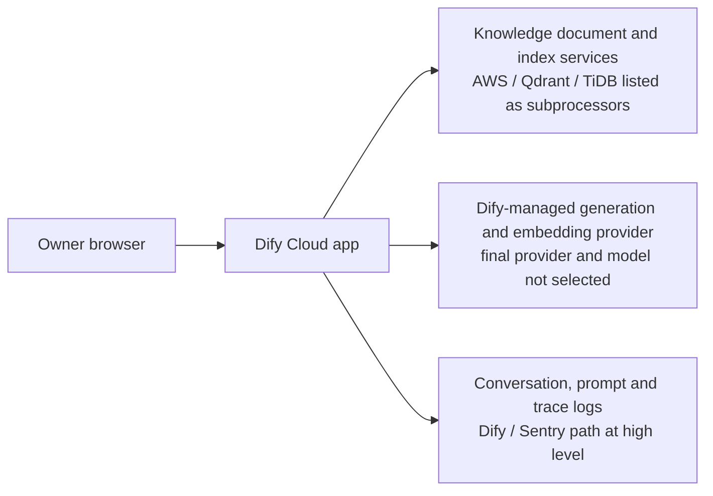

# Dify Official Evidence — Pre-K3.3

## Record

- `evidence_id`: `af-ka-01-dify-official-docs`
- `version`: `1.1.0`
- `previous_version`: `1.0.0`
- `verified_on`: `2026-08-20`
- `source_scope`: תיעוד, מסמכים משפטיים ודפי תמחור רשמיים של Dify בלבד
- `verification_mode`: קריאה ציבורית בלבד; ללא חשבון, Login או פעולה אצל הספק
- `overall_result`: `partial_evidence_no_go`

## Evidence Status Vocabulary

- `documented`: המקור הרשמי מתאר את היכולת או המגבלה.
- `inference`: מסקנה תכנונית שאינה התחייבות מפורשת של הספק.
- `requires_ui_verification`: יש לאמת בעתיד בממשק, ורק לאחר אישור נפרד.
- `blocked`: אין כרגע ראיה מספקת למעבר K3.3.

## Findings

| Area | Official evidence | Status | K3.3 effect |
|---|---|---|---|
| Sandbox limits | המסלול חינמי וכולל Workspace אחד, Member אחד, 5 Apps, 50 Knowledge documents, 50MB, 200 message credits, 10 Knowledge requests/minute, 5,000 API requests/month ו-30 ימי Logs. צריכת Credits משתנה לפי Model. | `documented` | מתאים עקרונית ל-Prototype קטן; אינו Hard Stop כספי מותאם ל-100 ₪. |
| Payment and overage | לאחר סיום Credits ניתן לעבור ל-API key פרטי. שימוש ב-Credits וב-Provider key יכול להתקיים יחד עם עדיפות/Fallback. לא נמצאה התחייבות מפורשת שאין דרישת כרטיס, Auto-upgrade או חיוב חריגה במסלול Sandbox. | `requires_ui_verification` | BYOK, Payment method, Paid plan ו-Fallback ל-Provider key SHALL remain disabled. Cost gate עדיין חסום. |
| Storage region | Dify מצהירה על Managed Cloud region והצפנה במעבר ובמנוחה, אך אינה מפרסמת Region מדויק. ה-DPA קובע שפעולות העיבוד העיקריות בארה״ב; מדיניות הפרטיות מאפשרת עיבוד במדינות נוספות. | `blocked` | אין Region מדויק ל-Storage, Vector store או Logs. |
| Subprocessors and model path | ה-DPA מציין בין היתר AWS, Cloudflare, Sentry, Qdrant, TiDB, OpenAI ו-Anthropic. Dify-managed models מעבירים מידע לספקי Model; BYOK כפוף גם לתנאי הספק שנבחר. Generation ו-Embedding models טרם נבחרו. | `partial_documented` | זרימה ברמה גבוהה ידועה; ה-Provider, Model, Region ונתיב Embedding הסופיים אינם ידועים. |
| Workspace isolation | Sandbox מוגבל ל-Member אחד; Owner מנהל Workspace, Providers ו-Billing. Knowledge permissions זמינות. | `documented_requires_ui_verification` | מתאים עקרונית ל-Owner-only, אך יש לאמת Workspace/App/Knowledge בפועל. |
| Publishing | Web App ציבורי כברירת מחדל וכל בעל URL יכול לגשת אליו. Publish הוא שלב נפרד מ-Studio Preview. | `documented_hard_constraint` | אסור לפרסם Web App, API, Marketplace או Share link. Runtime עתידי SHALL use Studio-only Preview/Test Run. |
| App export | DSL export כולל App configuration, Workflow, prompts, model parameters וקישורי Knowledge; הוא אינו כולל Knowledge data, Logs/analytics או API keys. Secret environment variables יכולים להיכלל לפי בחירת המייצא. | `partial_documented` | Export SHALL select “No” for Secrets. DSL לבדו אינו Restore מלא. |
| Knowledge export | API רשמי מאפשר הורדת מסמכים שהועלו כקבצים כ-ZIP, Listing של Chunks ו-Metadata fields. הפעולות דורשות API key; לא בוצעו. | `partial_documented` | ניתן לתכנן Export, אך שלמות Metadata/Retrieval settings ו-Restore טרם הוכחה. המקור המקומי ב-Git נשאר Recovery authority. |
| Deletion | APIs רשמיים מתעדים מחיקת Document וכל Chunks שלו ומחיקת Knowledge Base וכל Documents שלו. App deletion מתועד כמחיקה קבועה של Config, Logs, Conversations, published access ונתוני App. | `partial_documented` | נתיב מחיקה לוגי קיים; אין ראיה לחלונות Backup/cache purge או הוכחת מחיקה בפועל. |
| Logs and retention | Logs כוללים שיחות, Inputs, Responses, raw prompts ו-Traces. ב-Sandbox הם נשמרים 30 יום ואז נמחקים. מחיקת Conversations/Logs אינה מוחקת Uploaded files. | `documented_with_gap` | אין להזין מידע אמיתי. יש למחוק Knowledge בנפרד; Backup retention נשאר לא ידוע. |
| Hebrew quality | Chatbot/Knowledge תומכים ב-Retrieval configuration, אבל לא נמצאה התחייבות רשמית לאיכות עברית. | `not_tested` | נדרש סט 25 השאלות לאחר אישורי Runtime ו-Indexing נפרדים. |

## High-Level Data Flow

התרשים הוא `inference` המבוסס על רשימת Subprocessors ותיעוד ה-Product. הוא אינו מצביע על Region מדויק, על Subprocessor יחיד שנבחר בפועל או על נתיב Network מאומת.

## Binding Local Controls

1. אין להשתמש ב-BYOK, API key של Model provider, Payment method או Paid subscription ללא החלטת Owner חדשה.
2. אין לפרסם Web App, API, Share link, Marketplace integration, Tool, Trigger או Plugin.
3. אין לכלול Secrets ב-DSL export.
4. הקורפוס המקומי ו-Configuration manifests ב-Git הם מקור האמת וה-Recovery authority.
5. גם אם UI עתידי מציג Sandbox ללא אמצעי תשלום, זו אינה הוכחה ל-Hard Stop מותאם ל-100 ₪; כל שינוי מסלול או Provider key מחייב עצירה.

## Unresolved Blockers

- Region מדויק ל-Storage, Index, Logs ולספקי Generation/Embedding.
- Retention ומחיקה של Backups, caches, analytics ו-support systems.
- Restore מלא של App + Knowledge + Chunks + Metadata + Retrieval settings.
- UI proof של Member יחיד, private resources, no publication, no payment method ו-no automatic paid fallback.
- מנגנון אכיף לתקרת 60/80/100 ₪ across Dify and model providers.
- בחירה מתועדת של App type, Generation model ו-Embedding model ותחזית Credits.

## Decision

- `decision`: `no-go`
- `reason`: התיעוד הרשמי מצמצם אי-ודאות, אך אינו סוגר Region מדויק, Backup retention, Restore מלא או Hard Stop כספי.
- `owner_residual_risk_decision`: accepted on `2026-08-20` for the frozen synthetic corpus only; not applicable to real data, clients or Production.
- `ui_inspection_status`: unauthenticated sign-in screen verified; no Email submitted and no OAuth started.
- `smallest_safe_next_step`: Owner performs Login manually and then confirms readiness for read-only authenticated UI inspection without Payment, Credentials, Upload, Indexing, Runtime or Publishing.

## Official Sources

- Dify Cloud pricing: https://dify.ai/pricing/dify-cloud
- Subscription management: https://docs.dify.ai/en/cloud/use-dify/workspace/subscription-management
- Model providers and credits: https://docs.dify.ai/en/cloud/use-dify/workspace/model-providers
- Team members: https://docs.dify.ai/en/cloud/use-dify/workspace/team-members-management
- App management and DSL export: https://docs.dify.ai/en/cloud/use-dify/workspace/app-management
- Web App settings: https://docs.dify.ai/en/cloud/use-dify/publish/webapp/web-app-settings
- Logs: https://docs.dify.ai/en/cloud/use-dify/monitor/logs
- Analysis and cost metrics: https://docs.dify.ai/en/cloud/use-dify/monitor/analysis
- Download documents: https://docs.dify.ai/en/api-reference/documents/download-documents-as-zip
- List chunks: https://docs.dify.ai/en/api-reference/chunks/list-chunks
- List metadata fields: https://docs.dify.ai/en/api-reference/metadata/list-metadata-fields
- Delete document: https://docs.dify.ai/en/api-reference/documents/delete-document
- Delete Knowledge Base: https://docs.dify.ai/en/api-reference/knowledge-bases/delete-knowledge-base
- Privacy policy: https://dify.ai/legal/privacy-policy
- Data Processing Agreement: https://dify.ai/assets/legal/data-protection-agreement.pdf
- Terms of Service: https://dify.ai/legal/terms-of-service
