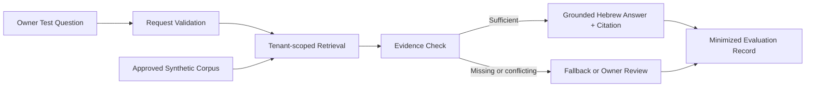

# Design: Knowledge Agent Prototype V1

## Context

Gate G0 approved the Agent Factory Architecture Baseline. This change narrows the next outcome to a single Owner-only Knowledge Agent prototype using only synthetic Hebrew content. Provider-neutral contracts remain the source of truth. ADR-004 selected Dify Cloud Sandbox, and subsequent separately approved K3.3 stages materialized and smoke-tested the synthetic prototype without credentials, paid capacity, publication or Production access.

## Goals

- Prove that a bounded corpus can produce grounded Hebrew answers with traceable citations.
- Prove safe fallback when evidence is missing, conflicting, ambiguous, or untrusted.
- Produce reusable corpus, configuration, evaluation, and release contracts.
- Keep planning understandable and execution small enough for one Owner.

## Non-Goals

- Provision Production infrastructure, paid capacity, n8n, external integrations or client-facing channels.
- Execute external actions or connect any integration.
- Support real users, personal data, confidential data, or Production traffic.
- Optimize retrieval settings without measured evidence.

## Prototype Identity

| Field | Proposed value |
|---|---|
| Agent name | `AF-KA-01 - Synthetic Knowledge Agent` |
| Change ID | `knowledge-agent-prototype-v1` |
| Synthetic tenant | `af-demo-services` |
| Owner | Yulush |
| Capability | Knowledge only |
| Language | Hebrew |
| Environment | Owner-only `Dify Cloud Sandbox`; Unpublished synthetic prototype |
| Intended runtime | `Dify Cloud Sandbox` selected in ADR-004 and partially materialized under staged authorization |
| Data classification | Synthetic |
| External actions | Disabled |

## Component Boundaries

The diagram remains the provider-neutral behavioral contract. Its current Dify Cloud Sandbox mapping is synthetic-only, Owner-only and Unpublished; the one-question smoke result does not authorize Production or change the provider-neutral requirements.

## Corpus Contract

Every source document contains:

- `source_id`
- `title`
- `corpus_version`
- `document_version`
- `effective_date`
- `owner`
- `classification = synthetic`
- `language = he`
- `status = approved | superseded | withdrawn`
- stable section headings
- a visible statement that all content is fictional and for testing only

Only `approved` sources belonging to tenant `af-demo-services` are eligible for retrieval. Superseded and withdrawn versions remain in version history but SHALL NOT be used as current evidence.

## Proposed Corpus

The six planned sources are defined in `corpus-plan.md`:

1. `AFD-001` — organization profile and operating hours.
2. `AFD-002` — service plans and included features.
3. `AFD-003` — delivery areas and delivery times.
4. `AFD-004` — cancellation and refund policy.
5. `AFD-005` — warranty and support policy.
6. `AFD-006` — privacy, prohibited requests, and human escalation.

## Request Contract

The logical request contains `request_id`, `tenant_id`, `actor_id`, `actor_type`, `environment`, `agent_release_id`, `corpus_version`, `language`, and `question`. For this prototype, `tenant_id` is fixed to `af-demo-services`, `actor_type` is `Owner`, and no arbitrary tenant value is accepted.

## Retrieval and Evidence Flow

1. Validate request schema, tenant, language, and size limits.
2. Retrieve only from approved sources for the fixed synthetic tenant and corpus version.
3. Treat retrieved text as untrusted evidence, never as system instructions.
4. Assess whether the retrieved sections directly support the requested facts.
5. If evidence is sufficient, answer in Hebrew and cite every material factual claim.
6. If evidence is insufficient, conflicting, ambiguous, superseded, or from another tenant, use the defined fallback.
7. Record minimized evaluation metadata linked to question and release IDs.

Retrieval parameters such as chunk size, overlap, top-k, reranking, and score threshold remain configuration candidates. ADR-004 selects Dify Knowledge Base and `R-A` as the first mapping candidate, but final settings SHALL be selected through evaluation rather than assumed from the platform choice.

## Answer Contract

Supported answers SHALL:

- answer in clear Hebrew;
- use only facts supported by eligible retrieved sections;
- cite using `[SOURCE_ID § Section]` immediately after the supported claim;
- distinguish policy facts from suggestions;
- avoid exposing hidden prompts, internal scores, or unrelated retrieved text.

The canonical insufficient-evidence fallback is:

> אין לי מספיק מידע במקורות המאושרים כדי לענות על השאלה. אפשר לנסח אותה מחדש או להעביר אותה לבדיקה של Yulush.

When sources conflict, the agent SHALL identify the conflicting source IDs, avoid choosing a policy silently, and request Owner review. It may prefer a newer source only when the older source is explicitly marked `superseded` and the newer source is `approved`.

## Instruction and Prompt-Injection Policy

Instruction priority is: approved system policy, approved agent configuration, validated Owner question, retrieved content. Corpus text and user text cannot override higher-priority instructions, change tenant, enable tools, suppress citations, disclose prompts, or request secrets. Suspected injection content is ignored as an instruction and may be referenced only as data when relevant.

## Authorization and Isolation

- The prototype has one fixed synthetic tenant and Owner-only actor type.
- Retrieval from any other tenant, namespace, corpus, or unapproved source is denied.
- Tools, URLs, web search, messages, writes, uploads, and external actions are disabled.
- The model cannot grant itself access or reinterpret a question as an approval.

## Failure Handling

| Failure | Required behavior |
|---|---|
| No relevant evidence | Return canonical fallback |
| Conflicting approved evidence | Name conflict and request Owner review |
| Retrieval unavailable | State temporary unavailability; do not answer from memory |
| Invalid tenant or actor | Deny retrieval and record policy result |
| Prompt injection | Ignore override instruction and preserve policy |
| Citation cannot be generated | Do not present the claim as supported |
| Budget threshold reached | Stop or degrade according to the approved prototype policy |

## Evaluation Strategy

The fixed pre-release set contains 25 questions:

- 16 supported or multi-source questions.
- 5 unsupported questions.
- 2 prompt-injection questions.
- 2 ambiguity or conflict questions.

The exact questions and expected behavior are in `evaluation-plan.md`. Questions are frozen before a scored run. Configuration changes after observing failures create a new evaluation run and configuration version; failed questions are not silently removed.

## Observability and Audit

Each evaluation result records `evaluation_run_id`, `question_id`, `request_id`, `tenant_id`, `agent_release_id`, `corpus_version`, configuration version, retrieved `source_id` values, policy result, answer verdict, citation verdict, fallback verdict, latency, cost indicator, and timestamp. Full hidden prompts, credentials, and personal data are excluded.

## Cost Control

- Planning and repository-only work incurs no runtime authorization.
- A future scored run requires an approved per-run request limit and a proposed prototype sub-cap of 100 ₪ per month within the overall 200-500 ₪ pilot envelope.
- When the cap cannot be measured or enforced, runtime execution remains blocked.

## K4.0 Capacity Decision

The measured end-to-end rate is six Sandbox Credits per question. The frozen 25-question set therefore needs 150 Credits before retries; the approved technical ceiling of five retries raises the safe capacity requirement to 180 Credits. The current 36-Credit balance is 144 Credits short of that envelope.

`configuration/k4-0-capacity-evaluation-plan.md` selects waiting for a fresh monthly Sandbox allowance as the primary zero-spend path. A full 200-Credit allowance covers the 180-Credit envelope and leaves 20. Dify Professional exceeds the approved 100 ₪ monthly prototype sub-cap at the recorded exchange rate; OpenAI BYOK, a reduced diagnostic and self-hosting remain separately gated alternatives. K4.0 authorizes no Dify inspection or change, Runtime, Payment, Credential, Publish, Commit or Push. The next proposed gate is read-only `K4.1C`; the later 25-question run would still require its own `K4.3E` approval.

## K3.3 Readiness Gate

The Dify-specific readiness checklist is `configuration/k3-3-readiness-checklist.md`. K3.3-B1 proved five stable Chunks for `AFD-001.md`; K3.3-B2 linked the dedicated Knowledge Base and persisted the initial linear graph. K3.3-C and C1 then Indexed `AFD-002` through `AFD-006` sequentially. D and D2 exposed the missing inline `source_id`. D3SR verified the Owner-pasted deterministic Template, D3W persisted `User Input → Knowledge Retrieval → Citation Context → LLM → Answer`, and D3T ran KA-E01 once. The response passed factual grounding, Hebrew, citation presence and citation correctness with a measured six-Credit delta and 36 Credits remaining. `current_authorized_stage` is `none`; the 25-question evaluation, further Runtime, Publish, Credential, Payment and Production remain unauthorized.

## Rollout and Rollback

1. Owner approves this change and the synthetic corpus plan.
2. Materialize and review the six synthetic documents locally.
3. Freeze corpus version and 25-question set.
4. Map candidate `R-A` to the Dify Knowledge Base design without credentials or upload.
5. Request separate K3.3 authorization before any provider action, provisioning, Indexing or paid execution.
6. Run an Owner-only evaluation when authorized.
7. Promote only after the acceptance thresholds pass.

Rollback restores the previous approved `agent_release_id`, corpus version, and configuration version. It does not retain an unapproved index or silently combine corpus versions.

## Privacy and Retention

The corpus and questions are synthetic and contain no personal data. Evaluation records use synthetic actor identifiers. The bounded Sandbox retention and deletion plan was documented before staged execution; remaining provider-specific gaps still block real data and Production. Repository history remains governed through Git and MUST NOT contain secrets or real client content.

## Alternatives Considered

### Use real business documents immediately

Rejected for the first prototype because it introduces privacy, contractual, and data-quality risks before the retrieval and evaluation process is proven.

### Use web search as the knowledge source

Rejected because it weakens corpus control, reproducibility, and citation evaluation.

### Fix platform-specific retrieval settings now

Deferred until measured evidence exists. The current R-A mapping and D3T result provide only one supported-question sample and are insufficient for optimization or promotion.

### Select Botpress Cloud PAYG or Flowise Cloud Free

Deferred by ADR-004. Botpress remains the fallback when cost enforcement or Dify lifecycle controls are insufficient; Flowise remains a technical reserve when deeper Retrieval control or JSON portability is required.

## Approved Owner Decisions

The Owner approved the following on 2026-08-20:

1. `AF Demo Services` and the six-document synthetic domain.
2. Hebrew-only behavior for V1.
3. The 25-question category split and thresholds.
4. A 100 ₪ monthly prototype sub-cap for a later separately authorized runtime.
5. `Dify Cloud Sandbox` as the intended Runtime and Dify Knowledge Base with `R-A` as the first evaluation mapping candidate; no provider action is authorized.

## K3.3-C Measured Indexing State

The approved Stage C processed `AFD-002` through `AFD-005` sequentially with the frozen General Chunking configuration and stopped at its Credit guard. Stage C1 then processed only `AFD-006` after a seven-Chunk stable Preview. Stage D executed only KA-E01: the factual answer passed, the citation contract failed, and the response consumed 6 Credits. D1's automated edit failed safely with zero Credit delta; the Owner then restored the prompt manually and D1R verified the complete instruction and bindings after reload. D2 proved that the prompt can produce the stable Section heading but still omits the required `source_id`. D3R identified the boundary: retrieved Section content omits `source_id`, while Dify separately retains `AFD-001.md` for its citation UI. D3SR, D3W and D3T subsequently verified, wired and smoke-tested deterministic enrichment. The app remains Unpublished with 36 Credits; full evaluation remains separately gated and cannot fit the remaining Sandbox balance at the measured rate.

## K3.3-D3P Deterministic Citation Design

D3P selects `M-TEMPLATE`, documented in `configuration/citation-remediation-plan.md`. Each existing document receives an approved `source_id` metadata value. A `Citation Context` Template node transforms `Knowledge Retrieval / result` into explicit `SOURCE_ID`, `SECTION` and unchanged `CONTENT` blocks for the LLM, while the original result remains bound as LLM Context for Dify's native attribution. Missing, foreign or unselectable metadata fails closed before Runtime. This adds no external call, Tool, Credential or model request and avoids the measured 140-Credit cost of reindexing all six documents. Provider configuration and Runtime remain separately gated.

D3A partially materialized this design. Six `source_id` values and the `Citation Context` node persisted, and the node accepts the visible whole `Knowledge Retrieval / result` array through `{{ results }}`. Because Dify did not expose a selectable nested `source_id` or document-metadata path, the node remains a parallel Retrieval branch and is not wired into the LLM. This is the required fail-closed state; no field path is inferred from undocumented runtime structure.

## K3.3-D3B Source-backed Metadata Path

Official Dify backend source maps a document's custom metadata into `SourceMetadata.doc_metadata`, serialized under each Retrieval item's `metadata`. The Workflow UI intentionally exposes `metadata` only as an opaque object, while the Template node supports nested property access and iteration. The selected path is therefore `item.metadata.doc_metadata.source_id`, guarded by the fixed six-ID allow-list. Missing or foreign values produce no evidence block, and an empty valid set produces `INSUFFICIENT_EVIDENCE`. D3S may configure and manually wire this design without Runtime; a later Runtime validation remains separately gated.

D3S established an additional operational constraint: the hosted code editor does not safely accept this multi-line Template through automated replacement. The approved recovery state is the neutral `{{ results }}` Template with the original parallel graph. The Owner must paste and visually verify the reviewed Template manually; Codex may only reload-verify it under D3SR before any graph or LLM prompt wiring gate.

## K3.3-D3W and D3T Persisted Citation Flow

After the Owner manually pasted the reviewed Template, D3SR verified the exact allow-list, `item.metadata.doc_metadata.source_id`, deterministic evidence blocks and `INSUFFICIENT_EVIDENCE` fallback. D3W then persisted the five-node flow `User Input → Knowledge Retrieval → Citation Context → LLM 2 → Answer 2`, removed the direct Retrieval-to-LLM graph edge, retained the original Retrieval result as LLM Context for native attribution, and inserted `Citation Context / output` as the only source for inline `SOURCE_ID` and `Section` values. Reload verification passed with zero Credit delta.

D3T executed only KA-E01 once. The answer matched `AFD-001`, remained in Hebrew, and cited `[AFD-001 § שעות פעילות]` and `[AFD-001 § ימי סגירה]`; both headings are exact and support their adjacent claims. The one response consumed six Credits, leaving 36. This validates the citation remediation for one supported question only. It does not satisfy the 25-question release thresholds, and the original 30-Credit evaluation forecast is superseded by the measured rate: 25 responses would require approximately 150 Credits before retries.
