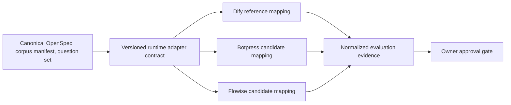

# Design: Portable Runtime Adapters v1

## Context

The knowledge-agent prototype currently uses Dify as the approved reference runtime. Its canonical behavior is defined in Git and OpenSpec, not in the provider UI. Portability therefore means reproducing the approved behavior and controls through a versioned mapping; it does not mean copying an opaque runtime graph or treating providers as interchangeable.

## Design Goals

1. Keep one canonical agent specification and corpus manifest.
2. Make provider capability gaps explicit before runtime activity.
3. Normalize evaluation evidence without hiding provider-native usage data.
4. Preserve Hebrew-only answers, source citations, fallback behavior, empty tool calls, isolation, and cost stops.
5. Permit only one separately approved external pilot at a time.

## Architecture

The canonical layer owns requirements, request/answer contracts, corpus versions, evaluation questions, and acceptance rules. Each adapter maps those assets to provider-native concepts and reports declared capabilities and gaps. The evaluation layer preserves both normalized results and raw provider references; it never invents missing citations or cost values.

## P0 — Runtime Adapter Contract

The contract is specified in `adapter-contract.md`. It is versioned independently of provider configuration and contains:

- adapter and runtime identity;
- canonical release and configuration identity;
- declared capabilities and unsupported controls;
- request, evidence, response, usage, cost, export, and deletion mappings;
- preflight results and drift indicators;
- fail-closed rules.

Contract operations are `validate_config`, `preflight`, `map_request`, `map_evidence`, `map_response`, `read_usage`, and `export_config`. PR-G1 implements local declaration and fixture validation only; provider adapters and live operations are absent.

## P1 — Evaluation Runner

The runner design is specified in `evaluation-runner-plan.md`. PR-G1 implemented a local standard-library dry runner with no network or model calls. It validates schemas, question-set completeness, citation syntax, fallback rules, tool-call emptiness, evidence completeness, and declared ceilings. Live execution remains a later gate.

## P2 and P3 — Provider Mappings

`botpress-mapping.md` and `flowise-mapping.md` map each candidate to the same contract. A mapping is not an approval or equivalence claim. Unknown behavior, missing export evidence, ambiguous citation metadata, or unenforceable spend control blocks a pilot.

### Botpress A0/A1 Evidence Boundary

Botpress A0 created one Free account through the official registration flow. The Owner entered all personal, authentication, and verification data; Codex did not enter or read those values. On first authenticated landing, Botpress exposed an automatically available default workspace and the `Create Bot` screen. No additional workspace or Bot was created.

Botpress A1 inspected only the existing default workspace, Usage page, and Billing summary. It observed a Free plan with 100 conversations, 1,000 table rows, 100 MB vector storage, 100 MB file storage, and a USD 10 AI-usage allowance, all with zero current use. The allowance is evidence of a displayed plan quota, not of enforcement or a provider-native hard stop. Plan management, payment, account identity, settings, integrations, tools, credentials, model configuration, knowledge, Runtime, and publication remained untouched.

This evidence narrows plan and quota uncertainty but does not change the fail-closed decision. Without a Bot or synthetic run, A1 cannot prove exact citation provenance, deterministic deny-all behavior, Hebrew fallback quality, client isolation, export/reconstruction, deletion, or cost-stop enforcement.

Botpress A2 inspected workspace-level controls only. Billing displayed AI-spend auto-recharge as disabled, while Usage exposed `Increase limits` and no visible hard-cap control. Workspace settings exposed deletion, membership, invitation, and audit surfaces. No workspace-level export control was present; Bot-level controls remained out of scope. Disabled auto-recharge is a useful guardrail but cannot substitute for the provider-native hard stop required by RP-107.

A2 also observed two distinct Bot routes after A1 had recorded the `Create Bot` state. Their origin and contents were not inspected. This is provider-configuration drift, not evidence that A1 was incorrect at its observation time. A future preflight cannot inherit the A1 workspace state or treat either Bot as approved; it must establish a new bounded configuration identity and receive separate Owner approval before inspection or execution.

Botpress A3 re-counted two distinct Bot routes without opening them. The Audits surface exposed no event rows, timestamps, or create/update/delete categories that could attribute the change. Three generic `8 hours ago` strings appeared on the workspace home page, but they could not be associated with either Bot or a creation event. Under the evidence contract, this weak signal is discarded rather than promoted to provenance. Bot creator, method, timestamp, configuration, and approval status therefore remain `unknown`, and drift reconciliation fails closed.

### Botpress Incident Hold and Containment

After A3, the Owner stated that she did not create the observed Bots. IR-A0 therefore treats the state as an internal configuration incident rather than ordinary candidate drift. The provisional severity is `SEV3`: the issue is confined to one Free, non-production workspace with no client data or known Runtime activity, but unauthorized resources and storage drift affect account integrity.

IR-A0 confirmed two Bot routes, zero conversations, zero AI spend, zero table rows, zero vector storage, 1 MB file storage, a Free plan, and disabled auto-recharge. The file-storage increase from A1's 0 MB is evidence of additional state change but not proof of cause. No safely labeled Security, Session, MFA, Account, or Profile route was exposed; unknown user-menu controls were left untouched to avoid personal-data exposure.

Containment is fail-closed:

- The Owner is Incident Commander and controls identity-provider security actions.
- Codex is limited to minimized evidence capture and specification updates.
- Neither Bot may be opened, executed, modified, published, exported, or deleted while origin remains unknown.
- No credential, payment, model, data, Indexing, Emulator, or Runtime action is allowed.
- `INCIDENT-HOLD` supersedes the historical public `CONDITIONAL-GO` operationally.
- Resumption requires Owner-controlled account containment, a separately approved re-verification, a bounded current configuration identity, and an explicit incident disposition.

IR-A1 re-verified the same bounded non-personal surfaces on 2026-08-22. Two Bot routes and 1 MB file storage persisted, while conversations, AI spend, table rows, and vector storage remained zero. The plan remained Free, auto-recharge remained disabled, and no attributable audit events or safely labeled account-security routes appeared. This is a stable incident snapshot, not proof of authorization, inactivity inside the uninspected Bots, or completed account containment. Because Owner-controlled identity security has not been confirmed, the incident remains `Investigating` and cannot move to `Monitoring` or `Resolved`.

## Security Design

- Credentials MUST be runtime-specific, client-specific, least-privileged, and excluded from Git and evidence bundles.
- Provider workspaces, knowledge stores, logs, indexes, and configuration identifiers MUST not be reused across clients.
- Only approved synthetic content may enter a candidate runtime during the prototype phase.
- The adapter MUST normalize `tool_calls` to an empty array and reject evidence of an external action.
- Missing capability declarations, citation provenance, isolation evidence, deletion behavior, or cost controls MUST fail preflight.
- Raw provider evidence MAY be retained only under the approved evidence-retention policy and MUST be redactable and deletable.

## Cost Design

Provider-native units are preserved and accompanied by a normalized estimate with currency, conversion source, conversion timestamp, and confidence. A missing or stale conversion cannot be treated as zero. A future pilot requires both:

1. a provider-native spend or usage stop; and
2. an Owner-approved normalized ceiling in ILS.

The 25-question suite may include up to five separately counted technical retries, but no retries are implicit. A configuration change starts a new run.

## Alternatives Considered

### Duplicate independent agents

Rejected because behavior, prompts, citations, and controls would drift across providers.

### Immediate migration from Dify

Rejected because the Dify prototype is the current reference and alternative citation, export, deletion, isolation, and cost controls are not yet proven.

### Self-host every component now

Deferred because it adds operations, patching, monitoring, backup, and security responsibilities before portability requirements are validated.

### Direct custom runtime implementation

Deferred until the adapter and evaluation contracts show which provider abstractions are genuinely reusable.

## Rollout and Approval Gates

- **P0 complete:** local adapter-contract design is internally consistent.
- **P1 complete:** local dry-runner plan and evidence schema are documented.
- **P2 complete:** Botpress mapping, gaps, and stop conditions are documented.
- **P3 complete:** Flowise mapping, gaps, and stop conditions are documented.
- **PR-G0 — approved 2026-08-21:** Owner accepted the planning package only. No implementation follows automatically.
- **PR-G1 — approved and completed 2026-08-21:** the network-free local validator and dry runner passed synthetic validation.
- **PR-G2-Flowise-Preflight — completed 2026-08-21:** public official-source review only; decision `NO-GO` because official Flowise is archived and reaches EOL on 2026-08-31.
- **PR-G2-Botpress-Preflight — completed 2026-08-21:** public official-source review only; decision `CONDITIONAL-GO`, but account, authenticated inspection, and Runtime remain blocked.
- **PR-G2-Botpress-A0 — completed 2026-08-21:** one Owner-operated Free-account registration; the provider-assigned default workspace was present, but no additional workspace or Bot was created.
- **PR-G2-Botpress-A1 — completed 2026-08-21:** authenticated read-only verification of the Free plan and zeroed usage counters; no provider configuration changed and the runtime decision remains blocked.
- **PR-G2-Botpress-A2 — completed 2026-08-21:** authenticated read-only inspection found disabled auto-recharge, no visible hard cap, workspace deletion/membership/audit surfaces, no workspace-level export, and two uninspected Bot routes that invalidate the prior current-state assumption.
- **PR-G2-Botpress-A3 — completed 2026-08-21:** two Bot routes were confirmed without opening them, but no attributable audit event or timestamp was available; origin and configuration remain unknown and drift remains blocking.
- **PR-G2-Botpress-IR-A0 — completed 2026-08-21:** Owner disclaimed Bot creation; read-only triage found persistent Bot routes and file-storage drift but no conversations, AI spend, vector storage, or Runtime evidence. Status is `SEV3 / Investigating / INCIDENT-HOLD`.
- **PR-G2-Botpress-IR-A1 — completed 2026-08-22:** read-only re-verification found no additional drift relative to IR-A0, but account containment and Bot origin remain unverified; incident status is unchanged.
- **PR-G2 runtime pilot (not authorized):** any maintained candidate requires a new explicit gate for account, credentials, runtime, data, and cost authorization.

## Rollback and Reconstruction

The local validator and evidence are reversible uncommitted files and do not alter a provider. A future runtime pilot MUST demonstrate export of provider configuration references, preservation of the canonical Git assets, deletion of provider-side data, and reconstruction from an approved release manifest before it can pass.

## Open Questions for a Future Gate

- Which maintained candidate can preserve `source_id` and section-level citation provenance without prompt-only fabrication?
- Which candidate exposes reliable per-run usage and enforceable hard stops?
- Which export, deletion, log-retention, and workspace-isolation evidence is available on the intended plan?
- Does Hebrew answer quality remain within the approved acceptance thresholds?
