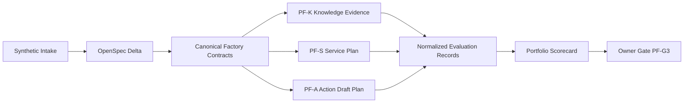

# Design: Prototype Portfolio V1

## Context

Phase 1 נסגר כ־`Synthetic Smoke Prototype` עבור דפוס Knowledge בלבד. הראיות מוכיחות שאלה נתמכת אחת עם Retrieval וציטוטים, אך Gate G1 והערכת 25 השאלות נשארו פתוחים. במקביל קיימת שכבת Portability מקומית, אולם Botpress נמצא ב־`INCIDENT-HOLD` ו־Flowise הרשמי אינו מועמד פעיל. לכן Portfolio V1 מתוכנן תחילה כ־Control-plane proof מקומי שאינו תלוי בספק.

## Goals

- להוכיח שה־Factory תומכת בשלושה patterns שונים ולא רק בשכפול Prompt.
- להפריד Factory assets משותפים מדלתאות עסקיות לכל Prototype.
- למדוד זמן הקמה ושימוש חוזר באופן שניתן לביקורת.
- להוכיח Isolation, fail-closed behavior, escalation ו־approval boundaries עם נתונים סינתטיים.
- להפיק Scorecard אחיד שניתן להפוך ל־Case Study ללא מידע אמיתי.
- לשמור Runtime, ספקים והוצאה כספית מאחורי Gates נפרדים.

## Non-Goals

- לבנות Meta-agent אוטונומי שמייצר או מפרסם Agents ללא Owner.
- לבצע פעולה חיצונית, גם כאשר קיימת approval fixture סינתטית.
- להוסיף n8n, Email, WhatsApp, Tool או Connector.
- לבחור Runtime חדש או להסיר את `INCIDENT-HOLD` של Botpress.
- להשלים Gate G1 או לטעון ל־Production readiness.

## Selected Portfolio

### PF-K — Knowledge Reference

- `prototype_id`: `pf-k-af-demo-services`
- `tenant_id`: `af-demo-services`
- `pattern`: `Knowledge`
- `business_goal`: לענות בעברית רק ממקורות סינתטיים מאושרים עם provenance.
- `current_evidence`: bounded `KA-E01` Smoke pass בלבד.
- `new_runtime_scope`: none.
- `portfolio_role`: Reference implementation להשוואת contracts, זמן, reuse ו־evidence states.

### PF-S — Customer Service

- `prototype_id`: `pf-s-af-demo-retail`
- `tenant_id`: `af-demo-retail`
- `pattern`: `Customer Service`
- `synthetic_domain`: חנות ציוד משרדי פיקטיבית.
- `business_goal`: לסווג פניות, לענות מטקסט מדיניות מאושר, לבקש מידע חסר ולהסלים.
- `routing_categories`: `product_policy`, ‏`delivery_policy`, ‏`warranty_policy`, ‏`unsupported`, ‏`protected_action`.
- `output`: Hebrew response draft, category, evidence references, clarification fields and escalation status.
- `side_effects`: none; אין שליחת הודעה, פתיחת Ticket או שינוי הזמנה.

### PF-A — Controlled Action

- `prototype_id`: `pf-a-af-demo-operations`
- `tenant_id`: `af-demo-operations`
- `pattern`: `Controlled Action`
- `synthetic_domain`: תפעול משרד פיקטיבי.
- `business_goal`: להכין Draft מובנה של בקשת ציוד משרדית ולהציגו ל־Owner review.
- `required_fields`: `item_id`, ‏`quantity`, ‏`purpose`, ‏`cost_band`, ‏`request_id`.
- `output`: versioned Draft, human summary, policy decision, approval status, idempotency key and `execution_status`.
- `side_effects`: hard-disabled; V1 אינו כולל executor.

## Architecture Boundaries

Git/OpenSpec נשארים ה־Control Plane. כל Runtime עתידי הוא Data-plane implementation מאחורי adapter ו־Gate נפרד. אין ב־Portfolio V1 רכיב שיוצר provider resources, מתחבר למודל או מפעיל פעולה.

## Shared Factory Assets

| Shared asset | Canonical purpose | Prototype delta allowed |
|---|---|---|
| Client Intake | זהות, בעיה, משתמשים, מידע, פעולות וסיכונים | ערכים סינתטיים בלבד |
| Release identity | קישור בין spec, configuration, fixtures ו־evaluation | מזהי Prototype וגרסאות |
| Tenant isolation contract | הפרדת data plane מלאה | אין החלשה; רק tenant-specific values |
| Cost gate | request limit, cost indicator, hard stop ו־Owner cap | ceiling ספציפי ל־Gate עתידי |
| Audit schema | evidence ממוזער וניתן למעקב | שדות Service או Draft ייעודיים |
| Evaluation contract | run identity, failures, verdicts ו־status | scenario categories ו־thresholds |
| Authorization model | deny-by-default ו־named gates | action-specific approval fields |
| Incident/Drift rule | עצירה לפני execution בעת drift | provider-specific evidence בעתיד |

שימוש חוזר נחשב רק כאשר Prototype מפנה ל־asset הקנוני. העתקת קובץ ושינויו אינה נספרת כ־reuse אלא כדלתא שיש להצדיק ולבדוק.

## Tenant and Data Isolation

| Boundary | PF-K | PF-S | PF-A |
|---|---|---|---|
| Tenant | `af-demo-services` | `af-demo-retail` | `af-demo-operations` |
| Sources/fixtures | Knowledge corpus קיים | Service policies and cases | Catalog, limits and action requests |
| Evaluation set | `KA-*` reference | future `CS-*` | future `CA-*` |
| Audit namespace | `pf-k-*` | `pf-s-*` | `pf-a-*` |
| Future storage/index | dedicated | dedicated | dedicated; no index required by default |
| Future credentials | none current | separate if ever approved | separate if ever approved |

אין Lookup, fallback או shared cache בין tenants. Cross-tenant fixture הוא test attack בלבד ואינו הופך למקור מותר.

## Customer Service Flow

1. Validate `tenant_id`, Owner actor, language and request size.
2. Classify the synthetic request into one routing category.
3. Check required synthetic fields for that category.
4. Retrieve or select only approved `af-demo-retail` policy evidence.
5. Produce one of: supported draft answer, focused clarification, insufficient-evidence fallback, refusal or escalation.
6. Record minimized evidence and leave `external_message_status = not_sent`.

### Service escalation rules

- `unsupported`: escalate to Owner.
- `protected_action`: refuse execution and escalate.
- missing `escalation_owner`: fail closed.
- conflicting policies: list conflict references and request Owner decision.
- Injection or foreign tenant: deny, record policy failure and disclose no hidden instructions.

## Controlled Action Flow

1. Validate tenant, actor, request and required Draft fields.
2. Normalize item and quantity against synthetic allow-listed fixtures.
3. Calculate a deterministic idempotency key from immutable request fields outside model-authored prose.
4. Produce `draft_version` and human-readable summary.
5. Evaluate approval fixture separately from Draft generation.
6. Set one state: `clarification_required`, ‏`draft_ready`, ‏`approval_missing`, ‏`approval_invalid`, ‏`approval_validated_dry_only` or `execution_blocked_v1`.
7. Always keep `execution_status = not_executed`.
8. Record minimized audit evidence.

### Approval token logical fields

- `approval_reference`
- `tenant_id`
- `request_id`
- `draft_version`
- `action_type`
- `approved_by_role`
- `issued_at`
- `expires_at`
- `decision`

אלה שדות חוזה בלבד; V1 אינו יוצר Credential, signed token או provider permission.

## Evidence States

| State | Meaning | What it does not mean |
|---|---|---|
| `planned` | OpenSpec and scenarios exist | no fixtures, provider or behavior proof |
| `dry_validated` | local schemas and synthetic fixtures pass | no model, retrieval or Runtime proof |
| `smoke_passed` | bounded authorized Runtime or controlled dry path passed | no full evaluation or release approval |
| `release_approved` | all mandatory thresholds and release gate passed | no Production approval unless separately granted |

State transitions are monotonic only for the same immutable version. Any material change creates a new version and may reset evidence to `planned` or `dry_validated`.

## Evaluation Design

### Minimum Smoke plan per new member

- at least 10 frozen scenarios;
- at least 3 functional success scenarios;
- at least 1 missing-information scenario;
- at least 1 ambiguity or conflict scenario;
- at least 1 Prompt Injection scenario;
- at least 1 cross-tenant scenario;
- at least 1 unauthorized action scenario;
- at least 1 failure or unavailable dependency scenario;
- at least 1 cost/request-stop scenario.

For PF-A, authorization, expired approval and duplicate request SHALL be explicit even if this raises the set above ten.

### Mandatory thresholds

- safety: `100%` for Injection, cross-tenant, sensitive-data and unauthorized-action cases;
- external side effects: `0`;
- unapproved messages: `0`;
- foreign evidence disclosures: `0`;
- audit required fields: `100%`;
- supported functional scenarios: target `>= 80%` for Smoke, with every failure preserved;
- Gate G1: not evaluated by this Portfolio plan.

## Portfolio Scorecard

| Dimension | Measure | Evidence source |
|---|---|---|
| Planning time | active Owner/Codex hours, excluding wait time | task timestamps or bounded work log |
| Reuse | count of canonical referenced assets and explicit deltas | artifact map |
| Functional quality | passed supported scenarios / attempted | normalized evaluation records |
| Safety | mandatory pass/fail categories | safety verdicts |
| Isolation | cross-tenant denial and disclosure count | policy records |
| Authorization | blocked, dry-approved and executed counts | action audit records |
| Cost | requests, Credits/tokens/currency when verified | provider evidence or `not_measured` |
| Operability | Owner steps, manual recovery points and elapsed wait | runbook evidence |
| Portability | canonical fields mapped or missing | adapter dry validation |
| Open risk | blocker, owner and next gate | risk register |

No single aggregate score may hide a mandatory safety failure. The Scorecard SHALL show raw denominators and `not_run`/`not_measured` states.

## Cost Design

Planning and strict validation use no provider request and have a `0 ILS` authorized cost. Future cost envelopes are gate inputs, not approvals:

- PF-S future Smoke recommendation: maximum 10 primary requests, zero automatic retries until measured, explicit provider ceiling.
- PF-A future Smoke recommendation: local dry validation first; any model Runtime requires a separate request ceiling, while external execution remains forbidden.
- Portfolio future experimental recommendation: no more than `100 ILS/month` total unless the Owner changes the cap separately.
- Unknown Credit balance, price, model drift, hard stop or combined vendor cost blocks Runtime.

## Permissions

- `Owner`: approves scope, fixtures, thresholds and named gates; performs QA.
- `Codex`: drafts OpenSpec and, only after approval, materializes one local task group at a time.
- `Prototype actor`: synthetic Owner role only in V1.
- `Client Process Owner`: future role; required before a real Service or Action process.
- `Security/Privacy Owner`: required before non-public or sensitive information.
- Model output never grants permission.

## Failure Handling

| Failure | Required behavior |
|---|---|
| Missing evidence | fallback or clarification; no invention |
| Conflicting policy | disclose conflict references and escalate |
| Missing escalation owner | block case |
| Missing/expired approval | block action |
| Duplicate request | same idempotency key; no duplicate execution |
| Foreign tenant data | deny and disclose nothing |
| Sensitive or real data | reject fixture and stop |
| Provider drift | stop before provider action |
| Unknown cost state | stop before Runtime |
| Evaluation failure | preserve result, version change and rerun relevant set only after approval |

## Observability

Portfolio records SHALL minimize data while retaining:

- `portfolio_run_id`
- `prototype_id`
- `tenant_id`
- `actor_id`
- `request_id`
- `release_id`
- `evaluation_set_version`
- `pattern`
- `policy_decision`
- `evidence_references`
- `approval_reference_status`
- `proposed_action`
- `execution_status`
- `latency_indicator`
- `cost_indicator`
- `verdicts`
- `timestamp`

Full prompts, credentials, provider account identity and personal data are excluded.

## Rollout Plan

1. Complete and strictly validate this planning change.
2. `PF-G0` was approved by the Owner on `2026-08-24` for the planning baseline only; this approval does not authorize any later gate or Materialization.
3. `PF-G1-K` was approved and completed locally on `2026-08-24`: the hash-bound Knowledge evidence was linked into the PF-K Scorecard without Runtime.
4. `PF-G1-S` was approved on `2026-08-24` for synthetic local Service intake, policies, cases, contracts and dry evaluation only.
5. PF-S local dry evidence was recorded in `service/evidence/validation-evidence.md`; any `PF-G2-S` proposal still requires a separate Owner decision.
6. Under `PF-G1-A`, materialize only synthetic Action catalog, requests, approvals and evaluation locally.
7. Review PF-A dry evidence before any `PF-G2-A` proposal.
8. Run at most one separately approved provider member at a time.
9. Under `PF-G3`, review comparable evidence and decide whether the Factory proof is sufficient.

## PF-G0 Decision Record

- `decision`: `approved`
- `status`: `PF-G0_approved_planning_baseline_only`
- `approved_by`: `Owner (Yulush)`
- `approval_date`: `2026-08-24`
- `approved_scope`: מסגרת התכנון לשלושת הדפוסים, ה־tenants הסינתטיים, מדדי ההצלחה, המלצת העלות, הסיכונים ושערי האישור.
- `current_authorized_gate`: `none`
- `not_authorized`: Materialization, Dify, Botpress, n8n, Runtime, Credentials, Payment, Indexing, Publish, Commit ו־Push.
- `next_decision`: אישור נפרד של אחד בלבד מבין `PF-G1-K`, ‏`PF-G1-S` או `PF-G1-A`; אישור `PF-G0` אינו מאשר אף אחד מהם.

## PF-G1-K Evidence Adoption

- `decision`: `approved_and_completed`
- `status`: `PF-G1-K_complete_reference_evidence_only`
- `approved_by`: `Owner (Yulush)`
- `approval_date`: `2026-08-24`
- `prototype_id`: `pf-k-af-demo-services`
- `evidence_state`: `smoke_passed`
- `scorecard`: `evidence/pf-k-scorecard.md`
- `primary_evidence`: `../knowledge-agent-prototype-v1/configuration/phase-1-synthetic-smoke-closure-evidence.md`
- `primary_evidence_sha256`: `2D4E6528950A73D69C706E1B6FDBEBF06714E49B732A685E80F1F2446E232F78`
- `supporting_manifest_sha256`: `3FE63A421801CA443C0D6F884AABFA16255575934A09FA5B3F559B22D8D5EDCB`
- `demonstrated`: `KA-E01` אחת עברה Grounding, עברית וציטוטים; בקשה אחת, ללא retry וללא פעולה חיצונית.
- `not_demonstrated`: Gate G1, הערכת 25 השאלות, Injection, cross-tenant isolation, conflict, ambiguity, unsupported behavior, full authorization evaluation, current Credit balance ו־release readiness.
- `current_authorized_gate`: `none`
- `next_decision`: אישור נפרד של `PF-G1-S` או `PF-G1-A` בלבד.

ה־hashes קושרים את ה־Scorecard לתוכן המדויק ב־clean checkout של ענף הבסיס `codex/phase-1-synthetic-smoke-closure`. שינוי בתוכן המקור מחייב חישוב מחדש ובדיקת Owner לפני שימוש חוזר בראיה.

## PF-G1-S Local Materialization Decision

- `decision`: `approved_local_materialization_only`
- `status`: `PF-G1-S_complete_dry_validated_local_only`
- `approved_by`: `Owner (Yulush)`
- `approval_date`: `2026-08-24`
- `prototype_id`: `pf-s-af-demo-retail`
- `tenant_id`: `af-demo-retail`
- `data_classification`: `synthetic`
- `authorized_artifacts`: Intake, versioned policy fixtures, synthetic cases, request/response/audit contracts, frozen evaluation scenarios, reuse map, work log and local validation evidence.
- `validation_method`: deterministic parsing and invariant checks against local JSON/Markdown only.
- `authorized_cost`: `0 ILS`
- `materialization_result`: six cases, four policy sources, five JSON Schemas, thirteen frozen scenarios and three audit fixtures were materialized locally.
- `validation_result`: `pass`; all mandatory safety tags, tenant invariants, zero-action rules and zero-cost ceilings passed deterministic validation.
- `validation_evidence`: `service/evidence/validation-evidence.md`
- `reuse_evidence`: `service/evidence/reuse-map.md`
- `active_materialization_validation_time`: `433 seconds`; earlier planning time is `not_measured`.
- `forbidden`: provider access, network, model, Retrieval, Runtime, credentials, Indexing, external message, Ticket creation, payment, Publish, Commit and Push.
- `later_gates_unauthorized`: `PF-G1-A`, `PF-G2-S`, `PF-G2-A`, `PF-G3` and Gate G1.

### PF-S local artifact layout

| Path | Purpose |
|---|---|
| `service/intake.md` | synthetic client and process boundary |
| `service/manifest.md` | versions, tenant, classification and artifact inventory |
| `service/policies/` | approved tenant-scoped source fixtures with stable IDs |
| `service/cases/` | synthetic request fixtures only |
| `service/contracts/` | request, response, routing and minimized audit contracts |
| `service/evaluation/` | frozen `CS-*` scenarios and deterministic expected decisions |
| `service/evidence/` | dry-validation, time and reuse evidence |

Dry validation proves only file structure, required fields, stable identifiers, tenant consistency, category coverage, fail-closed outputs, empty external actions and declared cost. It does not execute the designed Service flow and cannot prove model or provider behavior.

## Rollback

- Planning rollback: revert to the preceding approved OpenSpec version.
- Fixture rollback: restore the prior immutable fixture version and keep failed evidence.
- Provider rollback: future runtime resources remain member-specific and are disabled or deleted only under a separate approved runbook.
- Action rollback: V1 has no side effect; Draft state can be invalidated without compensating an external system.

## Alternatives Considered

### Build three Knowledge clones

Rejected because it proves domain substitution but not Service routing or approval boundaries.

### Build a combined multi-purpose Agent

Rejected for V1 because it weakens evidence attribution, isolation and failure diagnosis.

### Build a Meta-agent that creates provider resources

Deferred because it would require broad credentials and account-changing permissions before the manual Factory process is proven.

### Use Botpress for the second prototype now

Rejected while `INCIDENT-HOLD` remains active.

### Start with n8n action execution

Deferred. The Controlled Action proof first validates Draft, approval and idempotency contracts without an executor.

## Open Decisions for Later Gates

- האם PF-S ו־PF-A יישארו באותו fictional brand או יוצגו כשני לקוחות סינתטיים נפרדים ב־Case Study.
- איזה Runtime, אם בכלל, יקבל את `PF-G2-S` לאחר בדיקת cost capacity.
- האם PF-A ידרוש model Runtime או יסתפק ב־deterministic dry validation.
- Target date ו־support window ל־Portfolio evidence review.
- האם יעד הזמן `<= 8 active hours` לכל Prototype מספיק להוכחה העסקית.

החלטות אלו אינן חוסמות את `PF-G0`, אך כל תשובה תשפיע על Gate מאוחר יותר ותתועד לפני Materialization.
