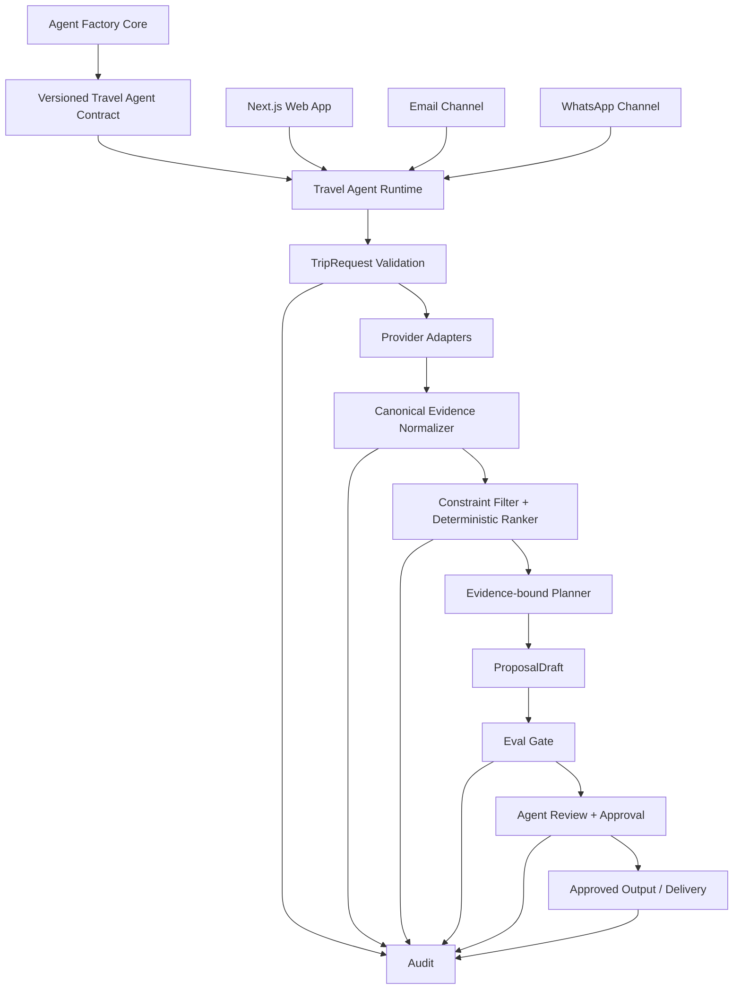

# תכנון: Travel Agent Instance Contract v1

## הקשר

כיום קיימים שלושה נכסים משלימים:

- `agent-factory-core` - Control Plane, Specs, Policies ו-Governance.
- `travel-agent-bot` - Python runtime עם Webform channel, Email, WhatsApp, sessions, handoff ו-travel tools.
- Web App שיוצא מ-Abacus - Next.js UI עשיר שמבצע כיום גם orchestration, provider search ו-LLM planning משלו.

היעד הוא לבטל את הכפילות העסקית: ה-Web App יהפוך ל-client/BFF דק של `travel-agent-bot`, וכל הערוצים ישתמשו באותו Contract.

## ארכיטקטורת יעד



## עקרונות חוזה

### 1. Channel-neutral

Web, Email ו-WhatsApp אינם יוצרים Proposal בעצמם. הם יוצרים או מעדכנים `TripRequest`, מפעילים generation דרך Runtime אחד ומציגים את אותו `ProposalDraft`.

### 2. Provider-neutral

החוזה אינו תלוי ב-SerpApi, Duffel, Hotelbeds, Amadeus או ספק אחר. Provider Adapter ממפה תוצאה ל-Evidence קנוני לפני שהPlanner רואה אותה.

### 3. Evidence before claims

מחיר או עובדה מסחרית חומרית שמוצגים כמאומתים חייבים `evidence_id`. מידע שאינו מגובה יכול להופיע רק כ-`estimate`, `assumption` או `unverified`.

### 4. Version before approval

כל Proposal הוא immutable ברמת גרסה. שינוי תוכן יוצר `proposal_version` חדש ו-`proposal_hash` חדש. Approval לעולם לא עובר לגרסה חדשה אוטומטית.

### 5. Eval before approval

`EvalResult.overall_status=FAIL` חוסם Approval. `PASS_WITH_WARNINGS` יכול להגיע לסוכן, אך האזהרות חייבות להיות מוצגות בזמן Review ונשמרות ב-Audit.

### 6. Partial instead of fabricated

חסר מידע שאינו מאפשר השלמה אמינה יוצר `PARTIAL_DRAFT` או `NEEDS_INFORMATION`, שומר את מה שכבר נבנה ומחזיר `missing_information[]` ו-`clarification_questions[]`.

## Contract objects

### `TripRequest`

מייצג את בקשת הנסיעה הקנונית ללא תלות בערוץ.

שדות ליבה:

- `schema_version: string`
- `request_id: string`
- `tenant_id: string`
- `created_at: datetime`
- `updated_at: datetime`
- `created_by_type: customer | agent`
- `actor_id: string` - pseudonymous audit identifier
- `data_classification: synthetic | public | personal`
- `consent_status: not_required | pending | granted | revoked`
- `contact: {name?, email?, phone?}`
- `origin: {label, iata_code?}`
- `destination: {label, iata_code?}`
- `departure_date: date`
- `return_date: date`
- `travelers: {adults, children[], infants}`
- `budget: {amount?, currency, hardness: hard | soft | unspecified}`
- `flight_preferences: {routing, cabin?, baggage?, preferred_times?}`
- `lodging_preferences: {category?, board?, neighborhoods?, amenities?}`
- `travel_styles: string[]`
- `constraints: Constraint[]`
- `free_text_notes?: string`
- `status: DRAFT | SUBMITTED | NEEDS_INFORMATION | READY_FOR_SEARCH | CLOSED`

Validation rules:

- `return_date >= departure_date`.
- traveler count > 0.
- currency חובה גם אם budget amount אינו מוגדר.
- `iata_code` אינו מומצא. אם resolution נכשל, נשמר label וה-request לא מתקדם לחיפוש שדורש IATA.
- `personal` מותר בחוזה אך אסור Runtime-wise עד Privacy/Security Gate מפורש.

### `EvidencePack`

אוסף immutable של Evidence records עבור generation מסוים.

שדות ליבה:

- `schema_version`
- `evidence_pack_id`
- `request_id`
- `generated_at`
- `records: EvidenceRecord[]`
- `coverage: {flight, hotel, place, transport, price}`
- `completeness_status: COMPLETE | PARTIAL | INSUFFICIENT`

`EvidenceRecord`:

- `evidence_id`
- `type: FLIGHT | HOTEL | PLACE | TRANSPORT | PRICE | OTHER`
- `provider`
- `provider_reference`
- `environment: test | evaluation | production | public`
- `searched_at`
- `expires_at?`
- `currency?`
- `amount?`
- `source_status: VERIFIED | UNVERIFIED | ESTIMATE | STALE | INVALID`
- `normalized_data`
- `raw_evidence_reference?`
- `restrictions[]`
- `missing_fields[]`
- `content_hash`

Price verification rule:

`VERIFIED` priced evidence requires `provider`, `provider_reference`, `searched_at`, `currency`, `amount` and valid environment/source classification.

### `ProposalDraft`

טיוטה versioned של הצעת הנסיעה.

- `schema_version`
- `proposal_id`
- `request_id`
- `proposal_version: integer`
- `proposal_hash`
- `created_at`
- `created_by_release_id`
- `evidence_pack_id`
- `status: AI_DRAFT | PARTIAL_DRAFT | NEEDS_INFORMATION | READY_FOR_REVIEW | APPROVED | SUPERSEDED`
- `summary`
- `flight_options[]`
- `hotel_options[]`
- `daily_itinerary[]`
- `estimated_totals[]`
- `assumptions[]`
- `warnings[]`
- `missing_information[]`
- `clarification_questions[]`
- `citations[]`

כל `flight_option`, `hotel_option` או priced element כולל `evidence_ids[]`.

### `EvalResult`

- `schema_version`
- `eval_id`
- `proposal_id`
- `proposal_version`
- `proposal_hash`
- `evaluated_at`
- `eval_suite_version`
- `overall_status: PASS | PASS_WITH_WARNINGS | FAIL`
- `checks: EvalCheck[]`

`EvalCheck` כולל `check_id`, `status`, `severity`, `message`, `evidence_ids[]`, `remediation_hint?`.

MVP mandatory checks:

- verified-price provenance
- currency presence
- dates/traveler consistency
- hard-constraint compliance
- route/stops compliance
- evidence coverage for selected flight/hotel
- itinerary/evidence contradiction check
- unsupported-fact detection
- secret leakage check
- unnecessary-PII output check
- prohibited-action check
- delivery-without-approval check

### `ApprovalRecord`

- `schema_version`
- `approval_id`
- `proposal_id`
- `proposal_version`
- `proposal_hash`
- `agent_id`
- `decision: APPROVED | REJECTED | CHANGES_REQUESTED`
- `decided_at`
- `comment?`
- `eval_id`
- `approval_scope: FINAL_PROPOSAL | DELIVERY | FUTURE_ACTION`

Approval validity:

Approval תקף רק אם `proposal_version` ו-`proposal_hash` תואמים לגרסה הנוכחית ו-Eval המקושר אינו `FAIL`.

### `AuditBundle`

- `schema_version`
- `audit_bundle_id`
- `tenant_id`
- `request_id`
- `proposal_id`
- `proposal_version`
- `created_at`
- `system_release_id`
- `request_snapshot_reference`
- `evidence_manifest[]`
- `ranking_record_reference`
- `model_record: {provider, model, configuration_version, prompt_template_version}`
- `eval_record_reference`
- `approval_record_reference?`
- `final_output_hash?`
- `delivery_record_reference?`
- `usage: {provider_calls, model_calls, input_tokens?, output_tokens?, estimated_cost?}`
- `policy_events[]`

Audit Bundle אינו כולל Secret, Credential value, API token, full provider payload או full prompt כברירת מחדל. PII נשמר רק ברפרנס למערכת הרשומה המורשית ולא משוכפל ל-Bundle.

## State transitions

```text
TripRequest:
DRAFT -> SUBMITTED -> READY_FOR_SEARCH
                   -> NEEDS_INFORMATION -> SUBMITTED

ProposalDraft:
AI_DRAFT -> READY_FOR_REVIEW
AI_DRAFT -> PARTIAL_DRAFT -> NEEDS_INFORMATION
PARTIAL_DRAFT -> READY_FOR_REVIEW
READY_FOR_REVIEW -> APPROVED
READY_FOR_REVIEW -> SUPERSEDED
APPROVED -> SUPERSEDED   (כאשר נוצרת גרסה חדשה)
```

אסור לבצע transition ישיר מ-`AI_DRAFT` ל-`APPROVED` ללא Eval ו-Agent decision.

## API direction

ה-Runtime העתידי יחשוף semantic endpoints בסגנון:

- `POST /v1/trip-requests`
- `PATCH /v1/trip-requests/{request_id}`
- `POST /v1/trip-requests/{request_id}/generate`
- `GET /v1/proposals/{proposal_id}`
- `POST /v1/proposals/{proposal_id}/evaluations`
- `POST /v1/proposals/{proposal_id}/approvals`
- `POST /v1/proposals/{proposal_id}/deliveries`
- `GET /v1/audit-bundles/{audit_bundle_id}`

Endpoint names הם Design direction בלבד ולא אישור Implementation.

## PII boundary

ה-Owner בחרה שמוצר היעד יתמוך בפרטי לקוח אמיתיים. עם זאת, `AGENTS.md` ו-`openspec/project.md` מגבילים את ה-MVP הנוכחי לסינתטי/לא-רגיש. לכן החוזה מגדיר `data_classification=personal`, אך Runtime SHALL reject או disable אותו עד Change נפרד שמאשר Privacy/Security, retention, lawful purpose/consent, encryption, access control, deletion ו-incident handling.

## Rollout order לאחר Gate Implementation עתידי

1. ליישם schemas ו-validation ב-`travel-agent-bot` ללא שינוי UI.
2. להוסיף adapters ו-Evidence normalization מאחורי API קיים.
3. להעביר Next.js `/api/submit` לפנות ל-Runtime במקום ל-LLM/Provider ישירות.
4. להוסיף Eval gate ו-versioned Approval.
5. להעביר PDF, Email ו-WhatsApp להשתמש רק ב-Approved Proposal.
6. להסיר orchestration כפול מה-Web App רק לאחר parity tests.
